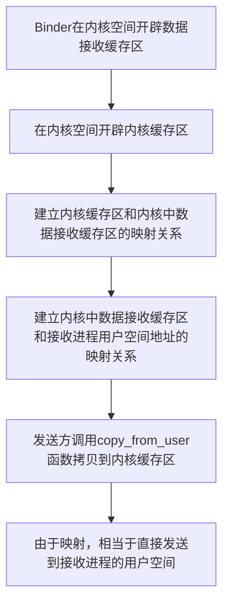

## Android的启动模式

有四大启动模式，分别是`standard`, `singleTop`, `singleInstance`, `singleTask`。

### standard标准模式

是默认启动模式， 如果没有为 Activity 设置启动模式，则使用这种。每次启动 Activity 都会重新创建一个实例入栈，不管这个实例是否已经在栈内存在。

每次创建的实例 Activity 都符合最典型的情况，`onCreate`, `onStart`, `onResume` 都会被调用。

### singleTop栈顶复用模式

有两种情况，如果需要创建的 Activity 已经处于栈顶，就要直接复用它，不会创建新的 Activity 。但是如果需要创建的 Activity 不在栈顶，就和 `Standard` 模式一样了。

生命周期里，如果需要创建的 Activity 已经再栈顶， `onCreate`, `onStart`就不会调用了，但是，会调用新的方法`onNewIntent`。

### singleTask栈内复用模式

若需要创建的 Activity 已经处于栈中时，此时不会创建新的 Activity ，而是将存在栈中的 Activity 上面的其它 Activity 全部销毁，使它成为栈顶。同 `SingleTop` 模式中的情况一相同，只会重新回调Activity中的 `onNewIntent` 方法。

### SingleInstance单实例模式

`SingleInstance` 比较特殊，是全局单例模式，是一种加强的 `SingleTask` 模式，它除了具有它所有特性外，还加强了一点：具有此模式的 Activity 只能单独位于一个任务栈中。这个常用于系统中的应用，例如Launch、锁屏键的应用等等，整个系统中只有一个！

比如 A Activity是该模式，启动 A 后，系统会为它创建一个单独的任务栈，由于栈内复用的特性，后续的请求均不会创建新的 Activity，除非这个独特的任务栈被系统销毁。


### 如何设定启动模式呢？

- 在 Manifest.xml中指定Activity启动模式

```xml
<activity android:name="MainActivity" android:launchMode="singleTask"/>
```

- 启动Activity时，在Intent中指定启动模式去创建Activity。这种方式比上一种优先级要高，若两者同时存在，是以这种方式为准。

```java
Intent intent = new Intent();  
intent.setClass(context, MainActivity.class);  
intent.addFlags(Intent.FLAG_ACTIVITY_NEW_TASK);  
context.startActivity(intent);
```


### 运用场景

- `SingleTask`模式的运用场景：最常见的应用场景就是保持我们应用开启后只有一个 Activity 的实例，最典型的例子就是应用中展示的主页（Home页）。假设用户在主页跳转到其它页面，执行多次操作后想返回到主页，如果不使用`SingleTask`模式，在点击返回的过程中会多次看到主页，这明显就是设计不合理了。
- `SingleTop`模式的运用场景：如果你在当前的 Activity 中又要启动同类型的 Activity，此时建议将此类型 Activity 的启动模式指定为`SingleTop`，可以减少 Activity 的创建，节省内存！

当一个Activity设置了`SingleTop`或者`SingleTask`模式后，跳转此Activity出现复用原有Activity的情况时，此Activity的`onCreate`方法将不会再次执行！`onCreate`方法只会在第一次创建Activity时被执行。

而一般`onCreate`方法中会进行该页面的数据初始化、UI初始化，如果页面的展示数据无关页面跳转传递的参数，则不必担心此问题，若页面展示的数据就是通过`getIntent() `方法来得到，那么问题就会出现：`getIntent()`获取的一直都是旧数据，根本无法接收跳转时传送的新数据！

这时，我们就需要使用`onNewIntent`了。此方法会传入最新的`intent`，这样我们就可以解决上述问题。这里建议的方法是重新去`setIntent`，然后重新去初始化数据和UI。

## 多进程通信

### Binder

> Binder是Android提供的一套进程间相互通信框架，它是一种效率更高、更安全的基于C/S架构的IPC通信机制，其本质也是调用系统底层的内存共享实现。

由于存在进程隔离，不同进程无法直接通信，但是**内核空间又被各个进程共享**，我们能否把数据由发送方交给内核，再让内核交给接收方呢？Linux 下的 IPC 机制正是利用了这个思路。但是，由于内核空间与用户空间同样存在隔离，无法实现直接传递。那么，我们就要想办法解决用户空间和内核空间之间数据传递的问题。

#### 用户/内核空间

现代操作系统都使用虚拟存储器，对于32位的系统，它的寻址空间就是$2^{32}$，也就是4GB。操作系统的核心就是内核。它独立于普通程序，可以访问受保护的内存空间，也有访问底层硬件设备的权限。为了保护内核，一般的应用程序不能直接操作内核。操作系统从逻辑上把虚拟空间划分成了用户空间和内核空间。将最高的1GB留给内核，较低的3GB分配给各个用户进程。为了保证安全性，它们之间是隔离的。

虽然分开了，但是不可避免地会出现用户程序需要访问内核资源的情况，比如文件操作、网络访问等。为了突破隔离限制，就需要借助系统调用。**系统调用是用户空间访问内核空间的唯一方式。** Linux使用了两级保护机制，0代表内核，3代表用户程序。

一个进程执行系统调用而陷入内核代码执行的时候， 就进入了内核态，处理器处于特权级最高的0级内核代码中执行。进程处于内核态的时候，执行的内核代码会使用当前进程的内核栈。每个进程都有自己的内核栈。

系统调用主要就是两个函数`copy_from_user(), copy_to_user()`。

#### 传统IPC通信原理

传统做法是把要发送的数据放进内存缓存区，通过系统调用进入内核态，内核在内核空间分配内存，开辟一块内核缓存区，调用`copy_from_user()`函数从用户空间的内存缓存区拷贝到内核空间的内存缓存区。同样，接收方在接受数据的时候也在自己的用户空间开辟一个内存缓存区，内核调用`copy_to_user()`拷贝到进程的内存缓存区。这样，就完成了。

不妨考虑一下有什么问题
- 性能低下：一次数据传递要经历两次拷贝
- 接收数据的进程并不知道需要多大的空间从来存放传入的数据。因此，只有两种方法。要么尽可能地开辟足够大的空间，要么调用API接受消息头来获取消息的大小。这么做，不是浪费空间就是浪费时间

### Binder IPC

#### 动态可加载与内存映射

> 跨进程通信是需要内核空间做支持的。传统的 IPC 机制如管道、Socket 都是内核的一部分，因此通过内核支持来实现进程间通信自然是没问题的。但是 Binder 并不是 Linux 系统内核的一部分，那怎么办呢？这就得益于 Linux 的动态内核可加载模块（Loadable Kernel Module，LKM）的机制；模块是具有独立功能的程序，它可以被单独编译，但是不能独立运行。它在运行时被链接到内核作为内核的一部分运行。这样，Android 系统就可以通过动态添加一个内核模块运行在内核空间，用户进程之间通过这个内核模块作为桥梁来实现通信。在 Android 系统中，这个运行在内核空间，负责各个用户进程通过 Binder 实现通信的内核模块就叫 Binder 驱动（Binder Dirver）。

在讲 Binder 的具体原理前，需要介绍一下内存映射。BInder 涉及到的内存映射通过 `mmap()`实现。这个函数时操作系统中一种内存映射的方法。简单说就是把用户空间的一块内存区域映射到内核空间。建立映射关系后，用户对这块内存区域的修改可以直接反应到内核空间，内核空间对这个区域的修改也能直接反映到用户空间。两个空间各自的修改能直接反映在映射的内存区域，从而被对方空间及时感知。也正因为如此，内存映射能够提供对进程间通信的支持。

进程中的用户区域是不能直接和物理设备打交道的，如果想要把磁盘上的数据读取到进程的用户区域，需要两次拷贝`（磁盘-->内核空间-->用户空间）`；通常在这种场景下 `mmap() `就能发挥作用，通过在物理介质和用户空间之间建立映射，减少数据的拷贝次数，用内存读写取代I/O读写，提高文件读取效率。

而 Binder 并不存在物理介质，因此 Binder 驱动使用 `mmap() `并不是为了在物理介质和用户空间之间建立映射，而是用来在内核空间创建数据接收的缓存空间。


#### 完整过程



#### 优势

- 性能：Socket 作为一款通用接口，其传输效率低，开销大，主要用在跨网络的进程间通信和本机上进程间的低速通信。消息队列和管道采用存储-转发方式，即数据先从发送方缓存区拷贝到内核开辟的缓存区中，然后再从内核缓存区拷贝到接收方缓存区，至少有两次拷贝过程。共享内存虽然无需拷贝，但控制复杂，难以使用。Binder 只需要一次数据拷贝，性能上仅次于共享内存。

- 稳定性：Binder 基于 C/S 架构，客户端（Client）有什么需求就丢给服务端（Server）去完成，架构清晰、职责明确又相互独立，自然稳定性更好。共享内存虽然无需拷贝，但是控制负责，难以使用。从稳定性的角度讲，Binder 机制是优于内存共享的。

- 安全性：传统的 IPC 接收方无法获得对方可靠的进程用户ID/进程ID（UID/PID），从而无法鉴别对方身份。Android 为每个安装好的 APP 分配了自己的 UID，故而进程的 UID 是鉴别进程身份的重要标志。传统的 IPC 只能由用户在数据包中填入 UID/PID，但这样不可靠，容易被恶意程序利用。可靠的身份标识只有由 IPC 机制在内核中添加。其次传统的 IPC 访问接入点是开放的，只要知道这些接入点的程序都可以和对端建立连接，不管怎样都无法阻止恶意程序通过猜测接收方地址获得连接。同时 Binder 既支持实名 Binder，又支持匿名 Binder，安全性高。

### Binder线程池

### AIDL

> AIDL全称是 `Android Interface Defination Language`，安卓接口描述语言。编译器可以根据 AIDL 生成一段代码，它封装了 Binder。
> 
> 它的本质就是对 Binder 机制封装。将它封装成一个代理对象。从用户的角度，就像客户端调用了服务端代码。

#### 使用步骤

记得去 `build.gradle`里在`buildFeatures`内把`aidl = true`设置上。
##### 服务端

1. 创建 Binder 接口
```	java
interface IMyAidlInterface {  
    int add(int num1, int num2);  
}
```
2. 编译一次。实现接口。
```kotlin
val binder = object : IMyAidlInterface.Stub(){  
    override fun add(num1: Int, num2: Int): Int{  
        val sum = num1 + num2  
        Log.d(TAG, "add($num1, $num2) = $sum")  
        return sum  
    }  
}
```
3. 创建服务，返回 Binder
```kotlin
class MyAidlService : Service() {  
    private val TAG = "MyAidlService"  
    private val binder = object : IMyAidlInterface.Stub(){  
        override fun add(num1: Int, num2: Int): Int{  
            val sum = num1 + num2  
            Log.d(TAG, "add($num1, $num2) = $sum")  
            return sum  
        }  
    }    override fun onBind(intent: Intent): IBinder {  
        super.onCreate()  
  
        Log.d(TAG, "onBind Called")  
        return binder  
    }  
  
    override fun onCreate() {  
        super.onCreate()  
        Log.d(TAG, "Service onCreate")  
    }  
    override fun onDestroy() {  
        super.onDestroy()  
        Log.d(TAG, "Service onDestroy")  
    }}

```

##### 客户端
1. 绑定服务
```kotlin
private fun bindMyService() {  
    if(!isBind){  
        val intent = Intent("killua.dev.aidldemo.IMyAidlInterface")  
        intent.`package` = "killua.dev.aidldemo"  
        bindService(intent, serviceConnection, Context.BIND_AUTO_CREATE)  
        Log.d(TAG, "Attempting to bind service...")  
    }}
```
2. 实现 ServiceConnection 并绑定监听，绑定回调将 IBinder 转换成 AIDL 接口代理对象
```kotlin
private val serviceConnection = object : ServiceConnection{  
    override fun onServiceConnected(  
        name: ComponentName?,  
        service: IBinder?  
    ) {  
        myAidlService = IMyAidlInterface.Stub.asInterface(service)  
        isBind = true  
        Log.d(TAG, "Service connected: $myAidlService")  
    }  
    override fun onServiceDisconnected(name: ComponentName?) {  
        myAidlService = null  
        isBind = false  
        Log.d(TAG, "Service disconnected")  
    }  
}
```

#### AIDL绑定过程

调用 `bindService` 方法，发起绑定请求。通过 ServiceManager拿到 AMS。通过 AMS 向 服务端发起 bindService 请求，服务端收到请求后以 Handler 消息机制的形式， 发送绑定服务的 Message。ActivityThread中处理这个请求，调用 onBind 函数，并返回 IBinder 对象。


## Activity的启动流程

## Service

### 生命周期

> Service 的生命周期管理主要依赖于两种启动方式：**`startService()`** 和 **`bindService()`**。但这两种方式并非互斥，它们可以组合使用。

无论哪种启动方法，都会经历这些核心方法：

- **`onCreate()`**: Service 第一次被创建时调用。这个方法只会被调用**一次**，无论 Service 被启动多少次或绑定多少次。你可以在这里执行 Service 的一次性初始化操作。
- **`onStartCommand(Intent, flags, startId)`** (或旧版 `onStart()`): 通过 `startService()` 方式启动时调用。每次调用 `startService()` 都会触发此方法。你可以在这里处理 Service 接收到的命令或数据。返回一个 `int` 值，指示系统如何处理 Service 被杀死后的重建问题（例如 `START_STICKY`、`START_NOT_STICKY`、`START_REDELIVER_INTENT`）。
- **`onBind(Intent)`**: 通过 `bindService()` 方式启动时调用。当客户端第一次尝试绑定 Service 时调用。此方法必须返回一个 `IBinder` 对象，它是客户端用于与 Service 交互的接口。
- **`onUnbind(Intent)`**: 当所有客户端都与 Service 解绑时调用。你可以选择性地返回 `true`，以允许 Service 在后续有客户端尝试绑定时再次调用 `onRebind()`。
- **`onRebind(Intent)`**: 只有当 `onUnbind()` 返回 `true` 后，后续有客户端尝试绑定 Service 时才会调用。
- **`onDestroy()`**: Service 生命周期结束时调用。这是 Service 被销毁前执行清理工作的最后机会，例如释放资源、注销监听器等。

#### 两种启动方式对生命周期的影响

##### 1. 通过 `startService()` 启动

- **启动流程**: `onCreate()` -> `onStartCommand()` (每次 `startService()` 都调用)
- **特点**:
    - Service 会在后台**独立运行**，与启动它的组件生命周期**无关**。即使启动它的 Activity 退出，Service 也会继续运行。
    - Service 启动后，其生命周期由自身管理。需要显式调用 `stopService()` 或 Service 内部调用 `stopSelf()` 来停止它。
    - 即使没有客户端绑定，Service 也会一直运行直到被停止或系统资源不足杀死。
- **停止流程**: `onDestroy()`

##### 2. 通过 `bindService()` 启动

- **启动流程**: `onCreate()` -> `onBind()`
- **特点**:
    - Service 会与一个或多个客户端（通常是 Activity 或 Fragment）**绑定**在一起。
    - Service 的生命周期与其绑定的所有客户端的生命周期**紧密关联**。只有当**所有**绑定到 Service 的客户端都解绑后，Service 才会被销毁。
    - **没有客户端绑定时，Service 即使被启动，也无法存活。**
- **停止流程**: 当所有客户端调用 `unbindService()` 或客户端自身销毁时，Service 会调用 `onUnbind()` (可选 `onRebind()`) -> `onDestroy()`。

#### 两种启动方式的交织情况

这是 Service 生命周期中最复杂的部分，但遵循一个核心原则：**Service 的 `onCreate()` 方法只会被调用一次。**

1. **先 `startService()`，再 `bindService()`：**
    
    - `startService()` 会触发 `onCreate()` -> `onStartCommand()`。
    - 接着 `bindService()` 会触发 `onBind()`。
    - 此时，Service 同时处于“已启动”和“已绑定”状态。
    - 如果此时调用 `stopService()`，**Service 不会立即被销毁**。它会继续运行，直到所有绑定的客户端都解绑（即不再有客户端调用 `unbindService()`）。当所有客户端解绑后，Service 才会执行 `onUnbind()` -> `onDestroy()`。
    - 如果此时客户端解绑（调用 `unbindService()`），Service 仍然不会销毁，因为它还处于“已启动”状态。只有在解绑后，再调用 `stopService()`，才会执行 `onDestroy()`。
2. **先 `bindService()`，再 `startService()`：**
    
    - `bindService()` 会触发 `onCreate()` -> `onBind()`。
    - 接着 `startService()` 会触发 `onStartCommand()`。
    - 此时，Service 也同时处于“已启动”和“已绑定”状态，后续行为同上。

#### Service 在开发中最常见的生命周期方法

最常关注和实现的回调方法是：

- **`onCreate()`**: **初始化 Service**。这是你进行所有一次性设置的地方，例如创建线程、初始化数据库连接、注册全局广播接收器等。由于它只调用一次，所以是执行重型初始化操作的理想场所。
- **`onStartCommand()`**: **处理启动命令**。如果你使用 `startService()` 方式启动 Service，这个方法是处理每次启动请求的关键。你可以在这里根据传入的 `Intent` 执行不同的任务，并返回适当的 `START_...` 值来指导系统在 Service 被杀死时的行为。
- **`onBind()`**: **提供客户端接口**。如果你需要允许其他组件与 Service 进行通信（例如进行远程方法调用），你必须实现此方法并返回一个 `IBinder` 实例。这个 `IBinder` 封装了 Service 提供给客户端的功能。
- **`onDestroy()`**: **执行清理工作**。这是 Service 生命周期结束前的最后机会。在这里，你应该释放所有占用的资源，例如停止后台线程、关闭网络连接、取消注册广播接收器、释放传感器监听器等，以防止内存泄漏。

#### 如何让service的进程具有较高的优先级

1. **Service 生命周期中的瞬时高优先级：** 当 Service 正在执行其核心生命周期方法时，例如 `onCreate()`、`onStartCommand()` 或 `onDestroy()`，系统会临时将其宿主进程视为**前台进程（Foreground Process）**。这是为了确保 Service 能够完成当前操作而不会被立即杀死。这个优先级是系统自动赋予的，无需额外操作。
    
2. **`startService()` 启动后的优先级：** 如果 Service 通过 `startService()` 方式启动，其宿主进程的优先级会高于那些没有可见组件（Activity）的后台进程，但通常会低于拥有可见 UI 的前台应用进程。这意味着在内存紧张时，Service 进程可能会比完全后台的进程更不容易被杀死，但仍有被杀死的风险。
    
3. **`bindService()` 绑定后的优先级：** 当一个客户端（例如一个可见的 Activity 或另一个前台 Service）绑定到你的 Service 时，Service 的宿主进程会获得与绑定它的客户端相同的优先级。如果绑定的客户端是**用户可见**或**前台**的，那么 Service 进程也会被视为**可见进程（Visible Process）**或**前台进程（Foreground Process）**，从而拥有非常高的优先级，极少会被系统杀死。这是因为系统认为 Service 在为用户当前的活跃操作提供支持。
    
4. **将 Service 设置为前台 Service：** 这是最常用且最有效的提升 Service 优先级的方法。通过调用 `startForeground(notificationId, notification)` 方法，可以将 Service 提升为**前台 Service（Foreground Service）**。
    
    - **核心特点：** 前台 Service 会在系统通知栏显示一个持续的通知（Notification），明确告知用户有任务正在后台运行。系统会认为前台 Service 是用户主动感知到的，因此即使在内存不足时，也极少会杀死前台 Service 进程。
    - **使用场景：** 音乐播放、导航、文件下载/上传、通话、健康追踪等需要持续运行且用户能感知到的任务。
    - **注意事项：** 必须提供一个有效的通知 ID 和 `Notification` 对象。从 Android 9 (API 28) 开始，如果应用进入后台后启动前台 Service，系统会抛出 `ForegroundServiceStartNotAllowedException`。从 Android 12 (API 31) 开始，启动前台服务有更多限制，例如需要新的权限 `FOREGROUND_SERVICE_CAPABILITY_MEDIA_PLAYBACK`。
5. **进程中存在其他高优先级组件：** 如果 Service 所在的进程中同时运行着其他高优先级的 Android 组件，如：
    
    - **用户可见的 Activity：** 进程被提升为前台进程。
    - **活跃的 Content Provider：** 如果另一个应用正在访问此进程中的 Content Provider，该进程优先级也会提高。
    - **使用中的 Broadcast Receiver：** 正在执行 `onReceive()` 方法的 Broadcast Receiver 也会临时提升宿主进程的优先级。 这些组件的存在会累加提升整个进程的重要性，从而间接提高 Service 被保留的可能性。

虽然直接提升进程优先级是关键，但为了 Service 的健壮性，还应考虑：

1. **返回合适的 `onStartCommand()` 值：**
    
    - `START_STICKY`：如果 Service 被系统杀死，系统会尝试重建 Service 并再次调用 `onStartCommand()`，但不会重新传递 Intent。适用于不依赖特定 Intent 数据的后台任务。
    - `START_REDELIVER_INTENT`：如果 Service 被系统杀死，系统会尝试重建 Service 并重新传递杀死前的最后一个 Intent。适用于需要处理特定数据的任务，确保数据不丢失。
    - `START_NOT_STICKY`：如果 Service 被杀死，系统不会尝试重建它。适用于不重要的、一次性任务。
2. **在 Service 中合理使用线程：** Service 本身运行在应用的主线程中。如果 Service 中有耗时操作（如网络请求、大量数据处理），务必在 Service 内部创建新的线程（如使用 `ThreadPoolExecutor` 或 Kotlin 协程）来执行，避免阻塞主线程导致 ANR (Application Not Responding)。
    
3. **使用 WorkManager（推荐替代方案）：** 对于无需立即执行、可延迟执行、能保证执行完成的后台任务，强烈推荐使用 WorkManager。WorkManager 是 Jetpack 库的一部分，它能够智能地管理后台任务的执行，即使应用退出或设备重启也能保证任务完成，并且能够利用 JobScheduler/AlarmManager 等机制，自动处理进程优先级和唤醒设备等复杂问题。它通常是比裸 Service 更好的选择，因为它更健壮、更省电。
## 
