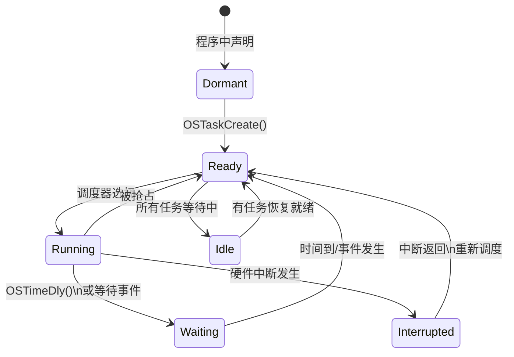
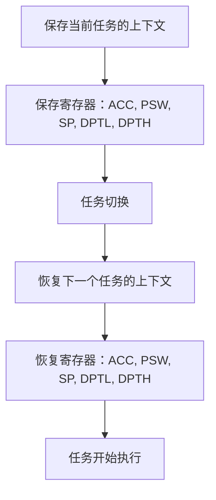
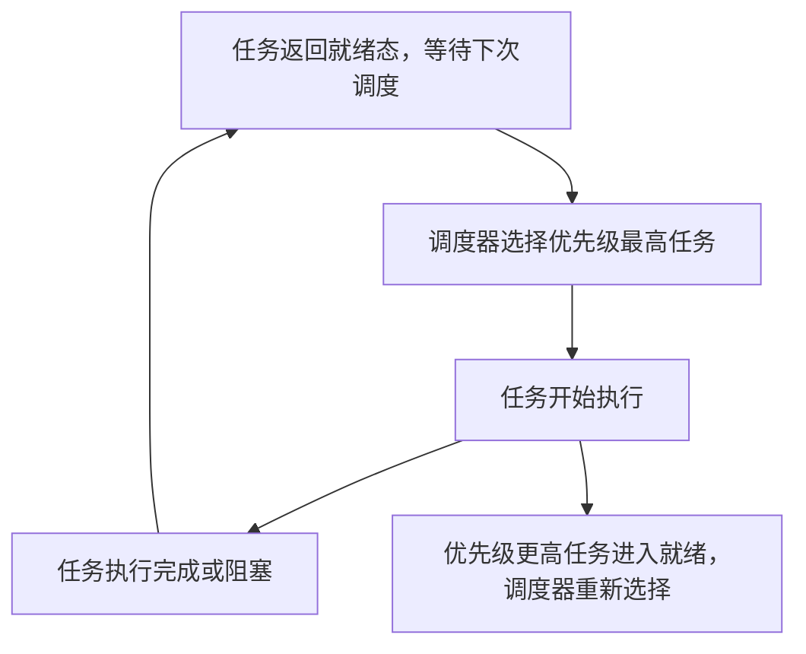

## 任务状态

多任务运行的实现依赖于 **CPU** 在多个任务之间进行 **快速切换和调度**。操作系统根据任务的优先级、状态以及事件触发情况决定何时切换任务。

### 五种状态

1. **休眠态（Dormant）**
   - 描述：任务已经定义（存在于程序中），但未被系统（uC/OS-II）创建或调度。
   - 举例：还未调用 `OSTaskCreate()` 的任务。
   - 📌 **补充说明**：任务在程序中声明但不参与调度，节省系统资源。

2. **就绪态（Ready）**
   - 描述：任务已经创建（通过 `OSTaskCreate()` 或 `OSTaskCreateExt()`），可以被调度，但当前没有被CPU执行。
   - 📌 **补充说明**：系统中可能有多个就绪任务，调度器将选择优先级最高的那个进入运行态。

3. **运行态（Running）**
   - 描述：当前被CPU执行的任务。
   - 特性：在任一时刻，只有一个任务处于运行态（单核CPU）。
   - 条件：只有当所有优先级更高的任务都阻塞或终止时，某任务才能进入运行态。

4. **挂起态（Waiting/Delayed）**
   - 描述：任务主动让出CPU资源，等待某个时间或事件。
   - 调用方式：如 `OSTimeDly()`、`OSTimeDlyHMSM()` 使任务延迟一段时间。
   - 状态恢复：时间到时，系统调用 `OSTimeTick()` 恢复其为就绪态。
   - 📌 **补充说明**：这是任务让出CPU的主动方式，用于实现任务间的延时控制或等待事件。

5. **被中断态（Interrupted）**
   - 描述：任务执行过程中遇到中断，被迫挂起，中断服务程序（ISR）控制CPU。
   - 特点：中断服务程序可能会激活其他任务（如信号量、事件触发）。
   - 📌 **补充说明**：中断返回时，系统需判断当前哪个任务的优先级最高，并进行可能的上下文切换。

---

### 空闲任务（Idle Task）

- 描述：当系统中所有任务都在等待状态（没有就绪任务）时，uC/OS-II 会自动执行一个空闲任务。
- 功能：
  - 节能处理（如进入低功耗模式）
  - CPU占用统计
- 📌 **补充说明**：空闲任务优先级最低，永远不会阻塞，始终保持就绪态。

---





## 上下文切换（Context Switch）

上下文切换指的是在多任务操作系统中，操作系统在不同任务之间切换时，保存和恢复任务的状态。具体来说，就是保存当前任务的 **CPU 寄存器内容**（称为上下文），然后加载下一个任务的上下文，继续执行。

### 任务切换的基本原理

1. **保存当前任务的上下文：**  
   当操作系统决定切换任务时，它需要先保存当前任务的 CPU 寄存器内容，包括程序计数器（PC）、状态字（PSW）等。
   
2. **恢复下一个任务的上下文：**  
   切换到下一个任务时，操作系统会将下一个任务的上下文从栈中恢复，并加载到 CPU 寄存器中，从而实现任务的切换。

### 任务切换的过程

- **保存当前任务的状态：**
   1. 保存寄存器值（包括程序计数器 PCL/PCH、累加器 ACC、程序状态字 PSW 等）。
   2. 将保存的数据入栈。

- **恢复下一个任务的状态：**
   1. 从栈中读取下一个任务的状态信息。
   2. 将状态信息恢复到寄存器。
   3. 启动任务的执行。

任务切换虽然确保了多任务的并行执行，但它也增加了系统的负担，因为每次切换时都要保存和恢复寄存器的状态。

---

### 任务切换的寄存器（以 8051 为例）

#### 需要保留的寄存器

- **通用寄存器：**  
   - `ACC`：累加器
   - `B`：B寄存器
   - `R0 - R7`：R0 至 R7 通用寄存器

- **程序状态字（PSW）：**  
   - `PSW`：程序状态字，用于保存标志位信息

- **数据指针：**  
   - `DPTR`：数据指针，包括 `DPH`（高字节）和 `DPL`（低字节）

- **堆栈指针：**  
   - `SP`：堆栈指针，指示当前堆栈的位置

#### 特殊功能寄存器（SFR）

- `P1, P2, P3`：端口1、端口2、端口3
- `TCON`：定时/计数控制寄存器
- `IE`：中断使能寄存器
- `PCON`：电源控制寄存器
- `SCON`：串行控制寄存器
- `SBUF`：串行数据缓冲器
- 等等...

#### 特殊功能寄存器地址
- `80H - FFH`：特殊功能寄存器区（SFR 高字节）
- `00H - 7FH`：普通寄存器区（R0 - R7）

---

### 任务切换的保护与恢复

在上下文切换过程中，保护和恢复寄存器的值是至关重要的。以下是 8051 微处理器的具体寄存器保护与恢复方法：

1. **保护（保存）寄存器：**
   - 在任务切换前，操作系统将当前任务的所有重要寄存器（如 `ACC`, `PSW`, `SP`, `DPTR` 等）保存到任务的栈中。

2. **恢复（加载）寄存器：**
   - 在任务切换时，操作系统会从任务栈中恢复寄存器的值，确保任务恢复到正确的状态。





## 任务切换与实时操作系统内核

在 **多任务系统** 中，内核负责管理各个任务的执行，分配 **CPU 时间**，并确保任务之间能够有效通讯。内核的主要职责之一是 **任务切换**，这是实现多任务并发执行的基础。

### 内核的基本服务：任务切换

- **任务切换（Context Switch）** 是内核提供的基本服务之一。它确保操作系统能够在不同任务之间切换执行，从而支持多任务操作。
- 内核通过保存当前任务的状态（寄存器等）并恢复下一个任务的状态来实现任务切换。
- 在内核运行中，**CPU 占用时间**通常非常小，一般在 **2% 到 5%** 之间，这意味着大部分时间 CPU 用于执行应用任务。

### 调度器（Scheduler）和调度策略

- **调度器（Scheduler）** 或 **调度程序（Dispatcher）** 是内核的核心组件之一，负责决定当前 **哪个任务应该被运行**。它根据一定的调度算法来选择下一个需要执行的任务。
- **调度策略**：大多数实时操作系统（RTOS）采用 **优先级调度法**，其中每个任务根据其重要性分配一个 **优先级**。调度器会选择优先级最高的任务进行执行。

### 基于优先级的调度

- 在 **优先级调度法** 中，CPU 总是选择 **就绪态（Ready）** **中优先级最高的任务**来运行。
- **优先级定义**：任务的优先级通常是静态分配的，根据任务的紧急程度或重要性进行排序。优先级高的任务会优先执行，低优先级的任务只有在没有高优先级任务时才会运行。
- **优先级反转**：一种可能出现的问题是 **优先级反转**，即低优先级的任务占用CPU资源，导致高优先级任务无法及时执行。通常通过一些机制（如优先级继承）来避免此类问题。

---

### 8位单片机与实时操作系统

- **8位单片机** 通常由于内存（RAM）有限，无法运行 **复杂的实时操作系统（RTOS）**。这些单片机的内存和计算能力限制了它们的调度能力和多任务处理能力。
- 尽管如此，基于 **简化的 RTOS** 或任务调度器，8位单片机仍能实现基本的任务切换和优先级管理。



## 基于优先级的调度策略

在 **uCos-II** 实时操作系统中，任务调度是通过 **优先级** 来实现的。每个任务都有一个优先级，优先级越高的任务会优先执行。

### 任务优先级

- 每个任务都有一个 **优先级**，任务越重要，赋予的优先级越高。
- 优先级分为 **静态优先级** 和 **动态优先级**：
  - **静态优先级**：优先级在应用程序执行过程中不变。
  - **动态优先级**：优先级在任务执行过程中是可变的，可以根据任务的状态或其他条件进行调整。

### uCos-II 调度策略实现

uCos-II 使用优先级调度策略，在 **OSSched** 函数中实现任务调度。

```c
void OSSched(void) {
    INT8U Y;
    OS_ENTER_CRITICAL();  // 进入临界区，禁止中断

    // 判断是否满足调度条件
    if ((OSLockNesting == 0) && (OSIntNesting == 0)) {
        // 计算优先级最高的任务
        y = OSUnMapTbl[OSRdyGrp];
        OSPrioHighRdy = (INT8U)((y << 3) + OSUnMapTbl[OSRdyTbl[OSRdyGrp]]);

        // 如果当前运行的任务不是优先级最高的任务
        if (OSPrioHighRdy != OSPrioCur) {
            // 获取当前最高优先级任务的控制块
            OSTCBHighRdy = OSTCBPrioTbl[OSPrioHighRdy];
            OSCtxSwCtr++;  // 任务切换计数器自增
            OS_TASK_SW();  // 调用任务切换宏进行任务切换
        }
    }

    OS_EXIT_CRITICAL();  // 离开临界区
}
````

在这个函数中：

- **OSRdyGrp** 和 **OSRdyTbl** 存储了所有处于就绪状态的任务。
    
- 通过 **优先级表**（如 `OSPrioHighRdy`），调度器可以找到 **优先级最高的任务**，并进行任务切换。

---

### 任务就绪表（OSRdyTbl）

**任务就绪表** 是 `uCos-II `中用于管理所有处于就绪状态的任务的数据结构。它是一个包含多个元素的数组，记录了每个任务的就绪状态。

#### 任务就绪表结构

- `OSRdyTbl` 数组的每个元素都是一个 **8位无符号整数**，用于表示任务组的就绪情况。
    
- 每个元素包含 8 个任务，每个任务的就绪状态由该元素的一个二进制位表示（0 表示不就绪，1 表示就绪）。
    
- uC/OS-II 支持最多 64 个任务，使用如下结构来管理任务的就绪状态：

- `OSRdyGrp`: `INT8U`（8 位无符号整数），每一位表示一个任务组是否有任务就绪。
- `OSRdyTbl[8]`: 每个成员也是 `INT8U`，共 8 个任务组，每组最多容纳 8 个任务。每一位表示一个任务是否就绪。

> **优先级号（Prio）范围：0 ~ 63**，其中：
> - `Y = prio >> 3`：确定属于哪个任务组（0 ~ 7）
> - `X = prio & 0x07`：确定在组内的位置（0 ~ 7）

#### 任务就绪表示例

| `OSRdyTbl`[0]           | `OSRdyTbl`[1]           | `OSRdyTbl`[2]           | `OSRdyTbl`[3]           |
| ----------------------- | ----------------------- | ----------------------- | ----------------------- |
| D7 D6 D5 D4 D3 D2 D1 D0 | D7 D6 D5 D4 D3 D2 D1 D0 | D7 D6 D5 D4 D3 D2 D1 D0 | D7 D6 D5 D4 D3 D2 D1 D0 |
| 任务 0-7 状态               | 任务 8-15 状态              | 任务 16-23 状态             | 任务 24-31 状态             |


- 每一位的状态表示对应任务的就绪状态。(从低位算起)
    
- 例如，若 `OSRdyTbl[0]` 的值为 `0x01`，则表示 **任务 0** 就绪，其他任务不就绪。
    

#### 任务组管理

为了提高任务就绪表的访问效率，**uCos-II** 使用了 **任务分组** 技术。任务就绪表中的每个成员表示一个 **任务组**，每个任务组包含 8 个任务的就绪状态。

- 通过变量 `OSRdyGrp` 可以快速确定某个任务组的状态，这样能加速任务的调度过程。

#### 示例：任务就绪表（`OSRdyTbl`）内容

假设 `OSRdyTbl[0] = 0x03`，即二进制 `00000011`，表示任务 0 和任务 1 是就绪的，其他任务未就绪。

| 任务优先级 | 任务 0 | 任务 1 | 任务 2 | 任务 3 | 任务 4 | 任务 5 | 任务 6 | 任务 7 |
| ----- | ---- | ---- | ---- | ---- | ---- | ---- | ---- | ---- |
| 就绪状态  | 1    | 1    | 0    | 0    | 0    | 0    | 0    | 0    |

---

### 任务调度的实时性

**uCos-II** 在任务切换时通过对任务就绪表的快速访问和任务分组的管理，确保了较高的 **实时性**。通过这种设计，调度器能够快速判断哪些任务处于就绪状态，并根据任务的优先级迅速做出调度决策，从而保证任务的及时响应。


---

### OSMapTbl 和 OSUnMapTbl

```c
const INT8U OSMapTbl[8] = {
    0x01, 0x02, 0x04, 0x08,
    0x10, 0x20, 0x40, 0x80
};
````

- `OSMapTbl[i]` 的作用：用于设置某个位置为 1。
    
- `OSUnMapTbl[val]` 的作用：获取 8bit 数据中 **最低位为 1 的位置**（即优先级最低位的位置）。
    
    - 例如：`OSUnMapTbl[0x80] = 7`，`OSUnMapTbl[0x22] = 1`
        

---

### 任务进入就绪态

使某个任务进入就绪态的代码如下：

```c
OSRdyGrp             |= OSMapTbl[prio >> 3];
OSRdyTbl[prio >> 3]  |= OSMapTbl[prio & 0x07];
```

#### 步骤说明：

1. 用 `prio >> 3` 得到任务组编号 `Y`，通过 `OSMapTbl[Y]` 把 `OSRdyGrp` 对应位设为 `1`
    
2. 用 `prio & 0x07` 得到组内编号 `X`，通过 `OSMapTbl[X]` 把 `OSRdyTbl[Y]` 中对应位设为 `1`
    

---

### 任务离开就绪态


```c
OSRdyTbl[prio >> 3] &= ~OSMapTbl[prio & 0x07];
if (OSRdyTbl[prio >> 3] == 0) {
    OSRdyGrp &= ~OSMapTbl[prio >> 3];
}
```

#### 步骤说明：

1. 计算任务优先级 `prio` 对应的组索引 `Y = prio >> 3` (等同于 `prio / 8`) 和该组内的位索引 `X = prio & 0x07` (等同于 `prio % 8`)。
2. 使用 `OSMapTbl[X]` 生成一个只有第 `X` 位是 1 的掩码，然后取反 `~OSMapTbl[X]`，生成一个只有第 `X` 位是 0 的掩码。
3. 将 `OSRdyTbl[Y]` 与此掩码进行按位与操作 `&=`，从而**清除** `OSRdyTbl[Y]` 的第 `X` 位。这表示优先级为 `prio` 的任务已不再就绪。
4. 检查清除位后 `OSRdyTbl[Y]` 是否为 0。若为 0，则表示优先级在 `Y * 8` 到 `Y * 8 + 7` 范围内的所有任务（即该优先级组内的所有任务）都不再就绪。
5. 若 `OSRdyTbl[Y]` 确实为 0，则使用 `OSMapTbl[Y]` 生成一个只有第 `Y` 位是 1 的掩码，取反 `~OSMapTbl[Y]`。
6. 将 `OSRdyGrp` 与此掩码进行按位与操作 `&=`，从而**清除** `OSRdyGrp` 的第 `Y` 位。这表示整个优先级组 `Y` 都已经没有就绪任务了。

#### 示例：任务优先级为 13

假设一个任务的优先级 `prio = 13` 离开就绪态。

1. 计算组索引 Y 和位索引 X：
    
    - `Y = 13 >> 3 = 13 / 8 = 1`
    - `X = 13 & 0x07 = 13 % 8 = 5`
    - 对应 `OSMapTbl[5]` 的值是 `0x20` (二进制 `00100000`)。
2. 执行第一行代码：
    
    - `OSRdyTbl[1] &= ~OSMapTbl[5];`
    - 这就是 `OSRdyTbl[1] &= ~0x20;`
    - 效果是清除 `OSRdyTbl[1]` 的第 5 位。例如，如果原来 `OSRdyTbl[1]` 是 `0x34` (二进制 `00110100`，表示优先级 10 和 13 就绪)，执行后变成 `0x14` (二进制 `00010100`，只剩优先级 10 就绪)。
3. 检查条件：
    
    - `if (OSRdyTbl[1] == 0)`
    - 检查 `OSRdyTbl[1]` 现在是否为 0。如果清除第 5 位后，`OSRdyTbl[1]` 变成了 0（意味着优先级 8-15 的任务都不就绪了），则执行下一步。
4. 如果条件为真，执行第二行代码：
    
    - `OSRdyGrp &= ~OSMapTbl[1];`
    - 对应 `OSMapTbl[1]` 的值是 `0x02` (二进制 `00000010`)。
    - 这就是 `OSRdyGrp &= ~0x02;`
    - 效果是清除 `OSRdyGrp` 的第 1 位，表示第 1 组优先级 (优先级 8-15) 已经没有就绪任务了。

---
### 查找优先级最高的就绪任务

```c
y = OSUnMapTbl[OSRdyGrp];            // 找到最高优先组 Y
x = OSUnMapTbl[OSRdyTbl[y]];         // 找到组内最高优先级任务 X
prio = (y << 3) + x;                 // 计算出实际优先级号
```

---

### 例子：加入任务优先级为 37 的任务

```c
prio = 37;          // 二进制 0010 0101
                    // 0x07 = 0000 0111
Y = prio >> 3 = 4
X = prio & 0x07 = 5

OSRdyGrp |= OSMapTbl[4];         // OSRdyGrp |= 0x10
OSRdyTbl[4] |= OSMapTbl[5];      // OSRdyTbl[4] |= 0x20
```

结果：

- `OSRdyGrp` 第 4 位为 1
    
- `OSRdyTbl[4]` 第 5 位为 1


```c
// 使任务进入就绪态
OSRdyGrp              |= OSMapTbl[prio >> 3];          // 设置所属任务组的就绪标志位
OSRdyTbl[prio >> 3]   |= OSMapTbl[prio & 0x07];        // 设置组内任务的就绪位

// 使任务离开就绪态
OSRdyTbl[prio >> 3] &= ~OSMapTbl[prio & 0x07];         // 清除对应的任务就绪位
if (OSRdyTbl[prio >> 3] == 0) {
    OSRdyGrp &= ~OSMapTbl[prio >> 3];                  // 若组内无任务就绪，则清除该组就绪标志
}

// 查找当前优先级最高的就绪任务
y = OSUnMapTbl[OSRdyGrp];                              // 找到任务组编号
x = OSUnMapTbl[OSRdyTbl[y]];                           // 找到组内编号
prio = (y << 3) + x;                                   // 得到优先级号
```

---

### 例子：有任务优先级为 3、25、46 的任务就绪，其他都未就绪，那么OSRdyGrp和OSRdyTbI的值分别是多少？

#### ➤ Step 1：确定每个任务对应的组和位

| 优先级号 (Prio) | Y = prio >> 3 | X = prio & 0x07 | OSMapTbl[Y] | OSMapTbl[X] |
| ----------- | ------------- | --------------- | ----------- | ----------- |
| 3           | 0             | 3               | 0x01        | 0x08        |
| 25          | 3             | 1               | 0x08        | 0x02        |
| 46          | 5             | 6               | 0x20        | 0x40        |

---

#### ➤ Step 2：设置对应的 OSRdyTbl 和 OSRdyGrp

##### OSRdyTbl 数组：

```c
OSRdyTbl[0] = 0x08;    // 00001000 --> 任务3就绪
OSRdyTbl[3] = 0x02;    // 00000010 --> 任务25就绪
OSRdyTbl[5] = 0x40;    // 01000000 --> 任务46就绪
```

#### OSRdyGrp：

```c
OSRdyGrp = 0x29;       // 00101001 --> bit0 (组0), bit3 (组3), bit5 (组5) 置1
```

---

#### 最终结果

```c
OSRdyGrp = 0x29;         // 二进制 00101001
OSRdyTbl[0] = 0x08;      // 任务3
OSRdyTbl[3] = 0x02;      // 任务25
OSRdyTbl[5] = 0x40;      // 任务46
其他 OSRdyTbl[n] = 0x00;
```


## 非占先式内核 / 协作式内核

- **定义:** 不可剥夺型内核。正在运行的任务会持续占用 CPU，直到它**自愿**放弃 CPU 的控制权（通过调用特定的系统函数，如延时、等待信号量、发送消息等），才会发生任务切换。
- **调度时机:** 任务切换只发生在当前任务主动让出 CPU 时。调度器只有在此时才会被调用，选择下一个就绪任务运行。

### 中断处理

- **中断处理方式:** 异步事件（如硬件中断）仍然由中断服务程序 (ISR) 来处理。
- **ISR 对任务状态的影响:** ISR 可以唤醒因等待事件而处于挂起状态的高优先级任务，使其变为就绪状态。
- **中断返回后的控制流:** **关键区别点**：中断服务程序执行完毕后，**CPU 控制权会立即返回给原来被中断了的那个任务**，即使现在有更高优先级的任务因为中断而变成了就绪态。
- **高优先级任务何时运行:** 那个因中断而就绪的高优先级任务，需要等待当前运行的低优先级任务**自愿放弃 CPU** 后，才能获得运行机会。

- **优点:**
    - 内核设计相对简单。
    - 在任务之间访问共享数据时，同步问题相对简化（因为不会在任务执行过程中发生意外的任务切换，但在 ISR 与任务之间访问共享数据仍需同步）。
- **缺点:**
    - **实时响应性差**：如果一个低优先级任务长时间不放弃 CPU，会导致所有高优先级任务得不到及时响应。
    - 可靠性依赖任务行为：任何一个任务的编程错误（例如，进入死循环或长时间不放弃 CPU）可能导致整个系统崩溃或所有其他任务饥饿。
    - 不适用于对时序要求严格或任务行为不可控的系统。

## 占先式内核 

- **定义:** 一种操作系统内核类型，允许高优先级的任务中断 (preempt) 正在运行的低优先级任务，立即获得 CPU 控制权。
- **特点:** 内核可以在任意时刻进行任务切换，只要有更高优先级的任务就绪。
- **优势:** 确保高优先级任务的实时响应性，满足严格的时序要求。**实时操作系统必须是占先式内核。**
- **对比:** 非占先式内核 (Cooperative Kernel) 要求任务主动放弃 CPU (yield)。

### 中断

- **定义:** 一个异步事件，由硬件或软件触发，暂停 CPU 当前的正常执行流程，转而处理该事件。
- **作用:** 是操作系统响应外部事件（如 I/O 完成、定时器到期）或内部异常的机制。
- **在占先式内核中:** 中断常用于唤醒或使更高优先级的任务就绪，进而触发占先式调度。
- **中断服务程序 (ISR):** 处理中断的特定代码段，应尽可能简短、快速，不进行阻塞操作。

### 重入函数 

- **定义:** 一个函数，可以在其执行过程中被中断，然后在中断服务程序 (ISR) 或另一个任务中再次安全地调用，而不会破坏数据或导致非预期结果。
- **特征:**
    - 不使用或保护性地使用全局/静态变量。
    - 不返回指向静态或全局数据的指针。
    - 不依赖于调用者提供的、在并发调用中可能改变的数据（除非这些数据也是重入的）。
    - 只调用重入函数。
- **重要性:** 在支持中断和多任务的占先式系统中，函数必须是可重入的，以避免并发访问问题。
- **可重入问题的解决措施：**
	- **使用信号量**
	- **全局变量改成局部变量**
	- **调用函数前先关断**
	- **避免访问共享资源**

## Q：占先式内核和非占先式内核的区别？

> 非占先式内核的**实时性不如占先式内核**
> 占先式内核里，**高优先级的任务可以打断低优先级的任务而被执行。**
> **非占先式内核中断服务后，控制器返回原任务，占先式内核中断返回后查找就绪表，查看任务调度。**

## 优先级反转 

- **定义:** 在占先式多任务系统中，由于对共享资源的访问（如互斥锁），一个高优先级的任务被一个或多个中等优先级的任务间接阻塞，导致优先级顺序被“颠倒”的现象。
- **核心:** 高优先级任务等待低优先级任务释放资源，而低优先级任务又被中等优先级任务占先，使得高优先级任务无法执行。

### 例子（优先级 H > M > L ）

1. 任务 L (低优先级) 运行，获取共享资源 R (如互斥锁)。
2. 任务 H (高优先级) 就绪，占先 L 运行。
3. 任务 H 尝试获取资源 R，发现被 L 占用，H 阻塞，等待 L 释放 R。此时 L 是唯一能让 H 继续运行的任务。
4. 任务 M (中等优先级) 就绪。由于 M 的优先级高于 L，M 占先 L 运行。
5. 任务 M 持续运行，阻止 L 执行并释放 R。
6. 结果：高优先级的任务 H 被中等优先级的任务 M 间接阻塞，直到 M 执行完毕让 L 运行并释放 R。优先级 H > M > L 实际上变成了 H < M (在等待 R 的过程中)。

### 解决方法

> 任务 L (低优先级) 持有共享资源 R。高优先级任务 H 尝试获取 R 并阻塞。中等优先级任务 M 占先了 L。结果 H 被 M 间接阻塞 (H < M)。

#### 优先级继承

- **机制:** 当一个低优先级任务 L 阻塞了一个高优先级任务 H 对共享资源 R 的访问时，低优先级任务 L 会临时“继承”高优先级任务 H 的优先级。当 L 释放资源后，其优先级恢复。
- **在例子中应用 (针对任务1高 > 任务2中 > 任务3低，任务3持有资源S，任务1阻塞在S上，任务2抢占任务3):** 当任务 1 试图获取资源 S 被阻塞时，任务 3 的优先级会被提升到任务 1 的优先级。这样任务 3 的优先级高于任务 2，可以不被任务 2 占先，尽快执行其临界区代码并释放资源 S，解除任务 1 的阻塞。
- **效果:** L 以 H 的高优先级运行其访问资源 R 的临界区代码，从而避免被中等优先级任务 M 占先，有效减少高优先级任务的阻塞时间。
- **特点/缺点:** 逻辑相对复杂，实现需要操作系统内核支持此协议。**uCos-II 等某些 RTOS 版本不直接支持内建的优先级继承协议，实现起来相对困难（需要手动管理优先级或使用更高级的 OS）。**

#### 优先级极限 

- **定义:** 为每一个共享资源 R 指定一个“优先级极限” (Priority Ceiling)，该极限是所有可能访问 R 的任务中最高的那一个任务的优先级。
- **机制:** 任务在**访问资源 R (获取锁) 时**，其自身的优先级会被立即提升到资源 R 的优先级极限（如果其当前优先级低于极限）。
- **在例子中应用 (针对任务1高 > 任务2中 > 任务3低，任务3持有资源S):** 资源 S 的优先级极限被设定为任务 1 的优先级。任务 3 在获取资源 S 时，其优先级立即提升到任务 1 的优先级。这样任务 3 的优先级就比任务 2 高，可以防止被任务 2 占先，从而顺利完成临界区并释放资源。
- **效果:** 任何优先级低于或等于资源极限的任务都不能占先持有资源的任务。实现相对简单，可以防止简单死锁。解决了多个高优先级任务（如任务1）可能因等待资源而被中优先级任务（如任务2）间接阻塞的问题。
- **特点/缺点:** **缺点在于，即使没有高优先级任务在等待，只要获取资源，任务优先级就会提升到极限，这可能导致不必要的优先级提升，占用 CPU 资源或影响其他不相关任务的调度。**

#### OSChangePrio函数 

- **作用:** 这是一个操作系统提供的 API 函数，用于**手动**改变一个任务的优先级。
- **与优先级反转的关系:** `OSTaskChangePrio` **本身不是一种自动解决优先级反转的算法**（如优先级继承或极限）。但在没有内建协议支持的系统中，开发者**可以理论上**通过手动调用此函数来实现一个简陋的优先级继承行为（例如，高优先级任务阻塞时，其等待的低优先级任务手动调用此函数提升自己优先级）。
- **注意:** 手动管理容易出错，且不如内建协议健壮和可靠。它是一个管理优先级的工具，而不是优先级反转的标准、自动解决方案。

## 任务间通信

### 资源

- 资源：任何为任务所占用的实体都可称为资源。资源可以是输入输出设备，例如打印机、键盘、显示器，资源也可以是一个变量，一个结构或一个数组等。
- 共享资源：可以被一个以上任务使用的资源叫做共享资源。为了防止数据被破坏，每个任务在与共享资源打交道时，必须独占该资源。这叫做互斥。
### 临界区

- 每个进程中访问临界资源的那段程序称为临界区，**临界资源是一次仅允许一个进程使用的共享资源**。
- **每次只准许一个进程进入临界区，进入后不允许其他进程进入**。
- 不论是硬件临界资源，还是软件临界资源，**多个进程必须互斥地对它进行访问。**

### 任务间互斥通信

- 实现任务间通讯最简便的办法是使用共享数据结构。特别是当所有到任务都在一个单一地址空间下，能使用全程变量、指针、缓冲区、链表、循环缓冲区等，使用共享数据结构通讯就更为容易。虽然共享数据区法简化了任务间的信息交换，但是必须保证每个任务在处理共享数据时的排它性，以避免竞争和数据的破坏。
- 与共享资源打交道时，使之满足互斥条件最一般的方法有：
	- 关中断
	- 使用测试并置位指令
	- 禁止做任务切换
	- 利用**信号量、邮箱、消息队列**
### 事件控制块 (Event Control Block - ECB)

- **定义:** `OS_EVENT` 数据结构。
- **用途:** uCOS-II 使用 ECB 来描述和管理**事件**，包括：
    - 信号量 (Semaphores)
    - 消息邮箱 (Message Mailboxes)
    - 消息队列 (Message Queues)
- **作用:** 记录等待该事件的任务列表、事件当前状态（如信号量计数）、事件类型等信息。

#### `OS_EVENT` 数据结构

```c
typedef struct {
    void *OSEventPtr;        /* 指向消息或消息队列的指针 */
    INTSu OSEventTbl[OS_EVENT_TBL_SIZE]; /* 等待该事件的任务列表 (就绪标志位) */
    INT16U OSEventCnt;       /* 计数器 (主要用于信号量，表示资源数量) */
    INT8U OSEventType;      /* 事件类型 (如 OS_EVENT_TYPE_SEM, OS_EVENT_TYPE_MBOX, OS_EVENT_TYPE_Q) */
    INT8U OSEventGrp;       /* 等待任务的优先级组 (OSEventTbl 的辅助查找) */
} OS_EVENT;
```

- `OSEventTbl` 和 `OSEventGrp` 一起用于高效地管理和查找等待在该事件上的任务（通过任务优先级）。

#### ECB 的主要操作函数

##### 补充：信号量

> 信号量实际上是一种约定机制，在多任务内核中普遍使用，信号量用于：
> 1. 控制共享资源的使用权（满足互斥条件）
> 2. 标志某事件的发生
> 3. 使两个任务的行为同步

--- 
##### 补充：消息邮箱

> 典型的消息邮箱也称作交换消息，是用一个指针型变量，通过内核服务，一个任务或一个中断服务程序可以把一则消息（即一个指针）放到邮箱里去。同样，一个或多个任务可以通过内核服务接收这则消息。

###### 消息邮箱用作二值的信号量。

- 在初始化时，将邮箱设置为一个非零的指针（如 `void *1`）
- 一个任务可以调用`OSMboxPend()` 函数来请求一个信号量
- 然后通过调用`OSMboxPost()`函数来释放一个信号量。
- 如果用户只需要二值信号量和邮箱，这样做可以节省代码空间。这时可以将`OS_SEM_EN`设置为`0`，只使用邮箱就可以了。
###### 使用消息邮箱实现任务延时与唤醒

- **核心思想:** 利用 `OSMboxPend()` 函数的**等待超时**功能来控制任务的执行时间。
- **模拟 `OSTimeDly(timeout)`:**
    - 任务调用 `OSMboxPend(..., timeout)`。
    - 如果在指定的 `timeout` 时间内**没有消息**发送到该邮箱，`OSMboxPend` 返回（通常带超时错误码）。
    - 任务在超时后解除阻塞，继续执行，实现**延时指定时长**的效果。
- **模拟 `OSTimeDlyResume()`:**
    - 当任务调用 `OSMboxPend(..., timeout)` 进入等待后。
    - 如果在 `timeout` **结束之前**，有**其他任务**向该邮箱发送了**任意消息**（即使是“哑”消息），`OSMboxPend`会**立即返回**。
    - 任务被**提前唤醒**，解除阻塞，继续执行，实现**通过事件提前终止延时**的效果，功能类似于对延时中的任务调用 `OSTimeDlyResume()`。
- **关键:** 利用邮箱的“有消息则立即解除等待，无消息则等待直到超时”的特性来实现时间控制，消息内容本身通常不重要。

--- 
##### 补充：消息队列

> 消息队列实际上是邮箱阵列。
> 通过内核提供的服务，任务或中断服务子程序可以将一条消息（该消息的指针）放入消息队列。同样，一个或多个任务可以通过内核服务从消息队列中得到消息。

###### 消息队列的使用

1. 初始化或者建立消息邮箱
2. 获取队列中的消息
3. 将消息放进队列中
4. 先进先出（FIFO），后进先出（LIFO）
5. 需要维护等待消息的的任务列表
6. 具有等待的超时计数器
7. 如果消息条数（指针数量）是1就变成邮箱了。
 
--- 


1. **创建/初始化事件 (Initialization):**
    
    - 功能: 创建并初始化一个事件控制块。
    - 函数示例:
        - `OSSemInit()` - 初始化一个信号量 ECB。 (注意：通常创建用 `OSSemCreate`)
        - `OSMboxCreate()` - 创建一个消息邮箱 ECB。
        - `OSQCreate()` - 创建一个消息队列 ECB。
2. **发送/发布事件 (Posting/Signaling):**
    
    - 功能: 向事件发送信号、释放资源或发送消息。这可能唤醒等待该事件的任务。
    - 函数示例:
        - `OSSemPost()` - 释放一个信号量。
        - `OSMboxPost()` - 发送一个消息到邮箱。
        - `OSQPost()` - 发送一个消息到消息队列。
    - 效果: 如果有任务正在等待该事件，系统会从等待任务列表中移除**优先级最高**的任务，并将其置于**就绪态**。
3. **请求/等待事件 (Pending/Waiting):**
    
    - 功能: 任务尝试获取资源或接收消息。如果事件未满足条件（如信号量计数为0，邮箱/队列为空），任务会进入等待状态。
    - 函数示例:
        - `OSSemPend()` - 请求一个信号量（P 操作）。
        - `OSMboxPend()` - 从邮箱接收消息。
        - `OSQPend()` - 从消息队列接收消息。
    - 效果: 如果事件未就绪，调用 `Pend` 的任务将从**就绪任务表**中移除，并被添加到对应 ECB 的**等待任务列表**中，进入**等待状态**。
4. **等待超时 (Waiting with Timeout):**
    
    - 功能: `Pend` 操作通常可以指定一个超时时间。
    - 效果: 如果在规定的超时时间内，事件仍未发生 (`Post`)，则等待的任务会因超时而解除阻塞，从等待列表中移除，重新变为**就绪态**。

以上操作构成了 uCOS-II 中任务间同步和通信的基础。

