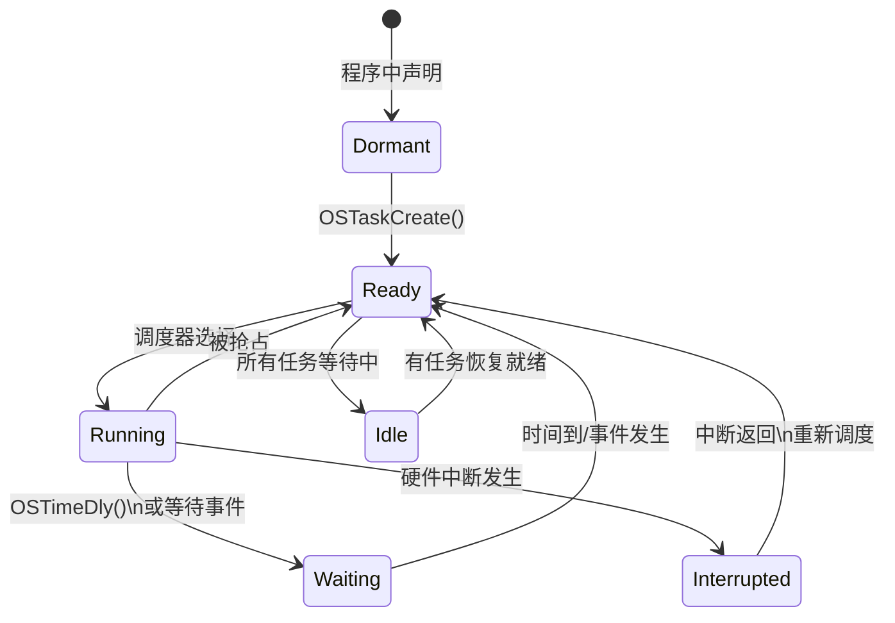
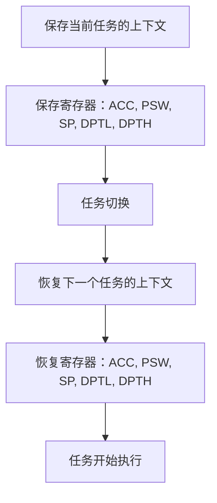
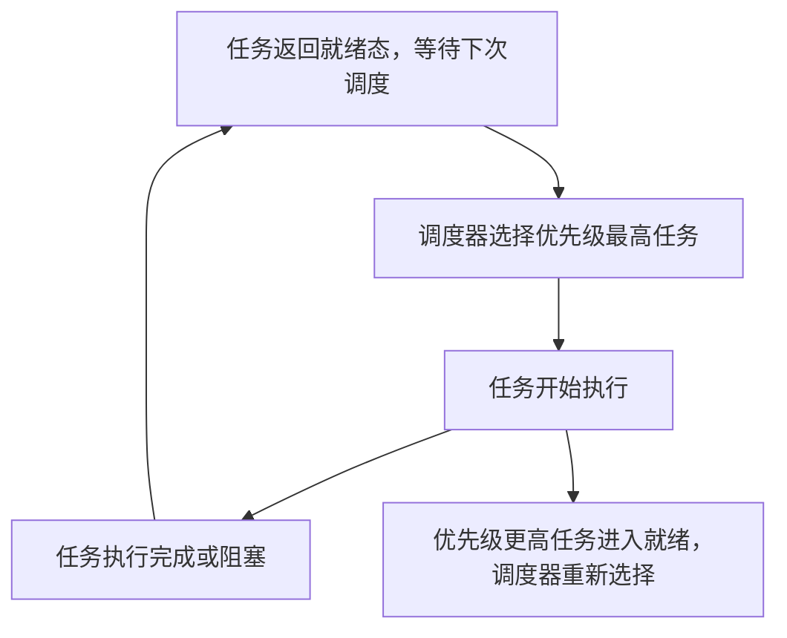

## 任务状态

多任务运行的实现依赖于 **CPU** 在多个任务之间进行 **快速切换和调度**。操作系统根据任务的优先级、状态以及事件触发情况决定何时切换任务。

### 五种状态

1. **休眠态（Dormant）**
   - 描述：任务已经定义（存在于程序中），但未被系统（uC/OS-II）创建或调度。
   - 举例：还未调用 `OSTaskCreate()` 的任务。
   - 📌 **补充说明**：任务在程序中声明但不参与调度，节省系统资源。

2. **就绪态（Ready）**
   - 描述：任务已经创建（通过 `OSTaskCreate()` 或 `OSTaskCreateExt()`），可以被调度，但当前没有被CPU执行。
   - 📌 **补充说明**：系统中可能有多个就绪任务，调度器将选择优先级最高的那个进入运行态。

3. **运行态（Running）**
   - 描述：当前被CPU执行的任务。
   - 特性：在任一时刻，只有一个任务处于运行态（单核CPU）。
   - 条件：只有当所有优先级更高的任务都阻塞或终止时，某任务才能进入运行态。

4. **挂起态（Waiting/Delayed）**
   - 描述：任务主动让出CPU资源，等待某个时间或事件。
   - 调用方式：如 `OSTimeDly()`、`OSTimeDlyHMSM()` 使任务延迟一段时间。
   - 状态恢复：时间到时，系统调用 `OSTimeTick()` 恢复其为就绪态。
   - 📌 **补充说明**：这是任务让出CPU的主动方式，用于实现任务间的延时控制或等待事件。

5. **被中断态（Interrupted）**
   - 描述：任务执行过程中遇到中断，被迫挂起，中断服务程序（ISR）控制CPU。
   - 特点：中断服务程序可能会激活其他任务（如信号量、事件触发）。
   - 📌 **补充说明**：中断返回时，系统需判断当前哪个任务的优先级最高，并进行可能的上下文切换。

---

### 空闲任务（Idle Task）

- 描述：当系统中所有任务都在等待状态（没有就绪任务）时，uC/OS-II 会自动执行一个空闲任务。
- 功能：
  - 节能处理（如进入低功耗模式）
  - CPU占用统计
- 📌 **补充说明**：空闲任务优先级最低，永远不会阻塞，始终保持就绪态。

---





## 上下文切换（Context Switch）

上下文切换指的是在多任务操作系统中，操作系统在不同任务之间切换时，保存和恢复任务的状态。具体来说，就是保存当前任务的 **CPU 寄存器内容**（称为上下文），然后加载下一个任务的上下文，继续执行。

### 任务切换的基本原理

1. **保存当前任务的上下文：**  
   当操作系统决定切换任务时，它需要先保存当前任务的 CPU 寄存器内容，包括程序计数器（PC）、状态字（PSW）等。
   
2. **恢复下一个任务的上下文：**  
   切换到下一个任务时，操作系统会将下一个任务的上下文从栈中恢复，并加载到 CPU 寄存器中，从而实现任务的切换。

### 任务切换的过程

- **保存当前任务的状态：**
   1. 保存寄存器值（包括程序计数器 PCL/PCH、累加器 ACC、程序状态字 PSW 等）。
   2. 将保存的数据入栈。

- **恢复下一个任务的状态：**
   1. 从栈中读取下一个任务的状态信息。
   2. 将状态信息恢复到寄存器。
   3. 启动任务的执行。

任务切换虽然确保了多任务的并行执行，但它也增加了系统的负担，因为每次切换时都要保存和恢复寄存器的状态。

---

### 任务切换的寄存器（以 8051 为例）

#### 需要保留的寄存器

- **通用寄存器：**  
   - `ACC`：累加器
   - `B`：B寄存器
   - `R0 - R7`：R0 至 R7 通用寄存器

- **程序状态字（PSW）：**  
   - `PSW`：程序状态字，用于保存标志位信息

- **数据指针：**  
   - `DPTR`：数据指针，包括 `DPH`（高字节）和 `DPL`（低字节）

- **堆栈指针：**  
   - `SP`：堆栈指针，指示当前堆栈的位置

#### 特殊功能寄存器（SFR）

- `P1, P2, P3`：端口1、端口2、端口3
- `TCON`：定时/计数控制寄存器
- `IE`：中断使能寄存器
- `PCON`：电源控制寄存器
- `SCON`：串行控制寄存器
- `SBUF`：串行数据缓冲器
- 等等...

#### 特殊功能寄存器地址
- `80H - FFH`：特殊功能寄存器区（SFR 高字节）
- `00H - 7FH`：普通寄存器区（R0 - R7）

---

### 任务切换的保护与恢复

在上下文切换过程中，保护和恢复寄存器的值是至关重要的。以下是 8051 微处理器的具体寄存器保护与恢复方法：

1. **保护（保存）寄存器：**
   - 在任务切换前，操作系统将当前任务的所有重要寄存器（如 `ACC`, `PSW`, `SP`, `DPTR` 等）保存到任务的栈中。

2. **恢复（加载）寄存器：**
   - 在任务切换时，操作系统会从任务栈中恢复寄存器的值，确保任务恢复到正确的状态。





## 任务切换与实时操作系统内核

在 **多任务系统** 中，内核负责管理各个任务的执行，分配 **CPU 时间**，并确保任务之间能够有效通讯。内核的主要职责之一是 **任务切换**，这是实现多任务并发执行的基础。

### 内核的基本服务：任务切换

- **任务切换（Context Switch）** 是内核提供的基本服务之一。它确保操作系统能够在不同任务之间切换执行，从而支持多任务操作。
- 内核通过保存当前任务的状态（寄存器等）并恢复下一个任务的状态来实现任务切换。
- 在内核运行中，**CPU 占用时间**通常非常小，一般在 **2% 到 5%** 之间，这意味着大部分时间 CPU 用于执行应用任务。

### 调度器（Scheduler）和调度策略

- **调度器（Scheduler）** 或 **调度程序（Dispatcher）** 是内核的核心组件之一，负责决定当前 **哪个任务应该被运行**。它根据一定的调度算法来选择下一个需要执行的任务。
- **调度策略**：大多数实时操作系统（RTOS）采用 **优先级调度法**，其中每个任务根据其重要性分配一个 **优先级**。调度器会选择优先级最高的任务进行执行。

### 基于优先级的调度

- 在 **优先级调度法** 中，CPU 总是选择 **就绪态（Ready）** **中优先级最高的任务**来运行。
- **优先级定义**：任务的优先级通常是静态分配的，根据任务的紧急程度或重要性进行排序。优先级高的任务会优先执行，低优先级的任务只有在没有高优先级任务时才会运行。
- **优先级反转**：一种可能出现的问题是 **优先级反转**，即低优先级的任务占用CPU资源，导致高优先级任务无法及时执行。通常通过一些机制（如优先级继承）来避免此类问题。

---

### 8位单片机与实时操作系统

- **8位单片机** 通常由于内存（RAM）有限，无法运行 **复杂的实时操作系统（RTOS）**。这些单片机的内存和计算能力限制了它们的调度能力和多任务处理能力。
- 尽管如此，基于 **简化的 RTOS** 或任务调度器，8位单片机仍能实现基本的任务切换和优先级管理。



## 基于优先级的调度策略

在 **uCos-II** 实时操作系统中，任务调度是通过 **优先级** 来实现的。每个任务都有一个优先级，优先级越高的任务会优先执行。

### 任务优先级

- 每个任务都有一个 **优先级**，任务越重要，赋予的优先级越高。
- 优先级分为 **静态优先级** 和 **动态优先级**：
  - **静态优先级**：优先级在应用程序执行过程中不变。
  - **动态优先级**：优先级在任务执行过程中是可变的，可以根据任务的状态或其他条件进行调整。

### uCos-II 调度策略实现

uCos-II 使用优先级调度策略，在 **OSSched** 函数中实现任务调度。

```c
void OSSched(void) {
    INT8U Y;
    OS_ENTER_CRITICAL();  // 进入临界区，禁止中断

    // 判断是否满足调度条件
    if ((OSLockNesting == 0) && (OSIntNesting == 0)) {
        // 计算优先级最高的任务
        y = OSUnMapTbl[OSRdyGrp];
        OSPrioHighRdy = (INT8U)((y << 3) + OSUnMapTbl[OSRdyTbl[OSRdyGrp]]);

        // 如果当前运行的任务不是优先级最高的任务
        if (OSPrioHighRdy != OSPrioCur) {
            // 获取当前最高优先级任务的控制块
            OSTCBHighRdy = OSTCBPrioTbl[OSPrioHighRdy];
            OSCtxSwCtr++;  // 任务切换计数器自增
            OS_TASK_SW();  // 调用任务切换宏进行任务切换
        }
    }

    OS_EXIT_CRITICAL();  // 离开临界区
}
````

在这个函数中：

- **OSRdyGrp** 和 **OSRdyTbl** 存储了所有处于就绪状态的任务。
    
- 通过 **优先级表**（如 `OSPrioHighRdy`），调度器可以找到 **优先级最高的任务**，并进行任务切换。
    

---

### 任务就绪表（OSRdyTbl）

**任务就绪表** 是 **uCos-II** 中用于管理所有处于就绪状态的任务的数据结构。它是一个包含多个元素的数组，记录了每个任务的就绪状态。

#### 任务就绪表结构

- `OSRdyTbl` 数组的每个元素都是一个 **8位无符号整数**，用于表示任务组的就绪情况。
    
- 每个元素包含 8 个任务，每个任务的就绪状态由该元素的一个二进制位表示（0 表示不就绪，1 表示就绪）。
    
- uC/OS-II 支持最多 64 个任务，使用如下结构来管理任务的就绪状态：

- `OSRdyGrp`: `INT8U`（8 位无符号整数），每一位表示一个任务组是否有任务就绪。
- `OSRdyTbl[8]`: 每个成员也是 `INT8U`，共 8 个任务组，每组最多容纳 8 个任务。每一位表示一个任务是否就绪。

> **优先级号（Prio）范围：0 ~ 63**，其中：
> - `Y = prio >> 3`：确定属于哪个任务组（0 ~ 7）
> - `X = prio & 0x07`：确定在组内的位置（0 ~ 7）

#### 任务就绪表示例

|`OSRdyTbl`[0]|`OSRdyTbl`[1]|`OSRdyTbl`[2]|`OSRdyTbl`[3]|
|---|---|---|---|
|D7 D6 D5 D4 D3 D2 D1 D0|D7 D6 D5 D4 D3 D2 D1 D0|D7 D6 D5 D4 D3 D2 D1 D0|D7 D6 D5 D4 D3 D2 D1 D0|
|任务 0-7 状态|任务 8-15 状态|任务 16-23 状态|任务 24-31 状态|

- 每一位的状态表示对应任务的就绪状态。
    
- 例如，若 `OSRdyTbl[0]` 的值为 `0x01`，则表示 **任务 0** 就绪，其他任务不就绪。
    

#### 任务组管理

为了提高任务就绪表的访问效率，**uCos-II** 使用了 **任务分组** 技术。任务就绪表中的每个成员表示一个 **任务组**，每个任务组包含 8 个任务的就绪状态。

- 通过变量 `OSRdyGrp` 可以快速确定某个任务组的状态，这样能加速任务的调度过程。
    

#### 示例：任务就绪表（`OSRdyTbl`）内容

假设 `OSRdyTbl[0] = 0x03`，即二进制 `00000011`，表示任务 0 和任务 1 是就绪的，其他任务未就绪。

|任务优先级|任务 0|任务 1|任务 2|任务 3|任务 4|任务 5|任务 6|任务 7|
|---|---|---|---|---|---|---|---|---|
|就绪状态|1|1|0|0|0|0|0|0|

---

### 任务调度的实时性

**uCos-II** 在任务切换时通过对任务就绪表的快速访问和任务分组的管理，确保了较高的 **实时性**。通过这种设计，调度器能够快速判断哪些任务处于就绪状态，并根据任务的优先级迅速做出调度决策，从而保证任务的及时响应。


---

### OSMapTbl 和 OSUnMapTbl

```c
const INT8U OSMapTbl[8] = {
    0x01, 0x02, 0x04, 0x08,
    0x10, 0x20, 0x40, 0x80
};
````

- `OSMapTbl[i]` 的作用：用于设置某个位置为 1。
    
- `OSUnMapTbl[val]` 的作用：获取 8bit 数据中 **最低位为 1 的位置**（即优先级最低位的位置）。
    
    - 例如：`OSUnMapTbl[0x80] = 7`，`OSUnMapTbl[0x22] = 1`
        

---

### 任务进入就绪态

使某个任务进入就绪态的代码如下：

```c
OSRdyGrp             |= OSMapTbl[prio >> 3];
OSRdyTbl[prio >> 3]  |= OSMapTbl[prio & 0x07];
```

#### 步骤说明：

1. 用 `prio >> 3` 得到任务组编号 `Y`，通过 `OSMapTbl[Y]` 把 `OSRdyGrp` 对应位设为 `1`
    
2. 用 `prio & 0x07` 得到组内编号 `X`，通过 `OSMapTbl[X]` 把 `OSRdyTbl[Y]` 中对应位设为 `1`
    

---

### 任务离开就绪态

```c
OSRdyTbl[prio >> 3] &= ~OSMapTbl[prio & 0x07];
if (OSRdyTbl[prio >> 3] == 0) {
    OSRdyGrp &= ~OSMapTbl[prio >> 3];
}
```

#### 步骤说明：

1. 清除 `OSRdyTbl[Y]` 的第 `X` 位。
    
2. 若 `OSRdyTbl[Y]` 全为 0，则表示该组无任务就绪，需要将 `OSRdyGrp[Y]` 也清零。
    

---

### 查找优先级最高的就绪任务

```c
y = OSUnMapTbl[OSRdyGrp];            // 找到最高优先组 Y
x = OSUnMapTbl[OSRdyTbl[y]];         // 找到组内最高优先级任务 X
prio = (y << 3) + x;                 // 计算出实际优先级号
```

---

### 例子：加入任务优先级为 37 的任务

```c
prio = 37;          // 二进制 0010 0101

Y = prio >> 3 = 4
X = prio & 0x07 = 5

OSRdyGrp |= OSMapTbl[4];         // OSRdyGrp |= 0x10
OSRdyTbl[4] |= OSMapTbl[5];      // OSRdyTbl[4] |= 0x20
```

结果：

- `OSRdyGrp` 第 4 位为 1
    
- `OSRdyTbl[4]` 第 5 位为 1


```c
// 使任务进入就绪态
OSRdyGrp              |= OSMapTbl[prio >> 3];          // 设置所属任务组的就绪标志位
OSRdyTbl[prio >> 3]   |= OSMapTbl[prio & 0x07];        // 设置组内任务的就绪位

// 使任务离开就绪态
OSRdyTbl[prio >> 3] &= ~OSMapTbl[prio & 0x07];         // 清除对应的任务就绪位
if (OSRdyTbl[prio >> 3] == 0) {
    OSRdyGrp &= ~OSMapTbl[prio >> 3];                  // 若组内无任务就绪，则清除该组就绪标志
}

// 查找当前优先级最高的就绪任务
y = OSUnMapTbl[OSRdyGrp];                              // 找到任务组编号
x = OSUnMapTbl[OSRdyTbl[y]];                           // 找到组内编号
prio = (y << 3) + x;                                   // 得到优先级号
```

---

### 例子：有任务优先级为 3、25、46 的任务就绪，其他都未就绪，那么OSRdyGrp和OSRdyTbI的值分别是多少？

#### ➤ Step 1：确定每个任务对应的组和位

| 优先级号 (Prio) | Y = prio >> 3 | X = prio & 0x07 | OSMapTbl[Y] | OSMapTbl[X] |
| ----------- | ------------- | --------------- | ----------- | ----------- |
| 3           | 0             | 3               | 0x01        | 0x08        |
| 25          | 3             | 1               | 0x08        | 0x02        |
| 46          | 5             | 6               | 0x20        | 0x40        |

---

#### ➤ Step 2：设置对应的 OSRdyTbl 和 OSRdyGrp

##### OSRdyTbl 数组：

```c
OSRdyTbl[0] = 0x08;    // 00001000 --> 任务3就绪
OSRdyTbl[3] = 0x02;    // 00000010 --> 任务25就绪
OSRdyTbl[5] = 0x40;    // 01000000 --> 任务46就绪
```

#### OSRdyGrp：

```c
OSRdyGrp = 0x29;       // 00101001 --> bit0 (组0), bit3 (组3), bit5 (组5) 置1
```

---

#### 最终结果

```c
OSRdyGrp = 0x29;         // 二进制 00101001
OSRdyTbl[0] = 0x08;      // 任务3
OSRdyTbl[3] = 0x02;      // 任务25
OSRdyTbl[5] = 0x40;      // 任务46
其他 OSRdyTbl[n] = 0x00;
```

